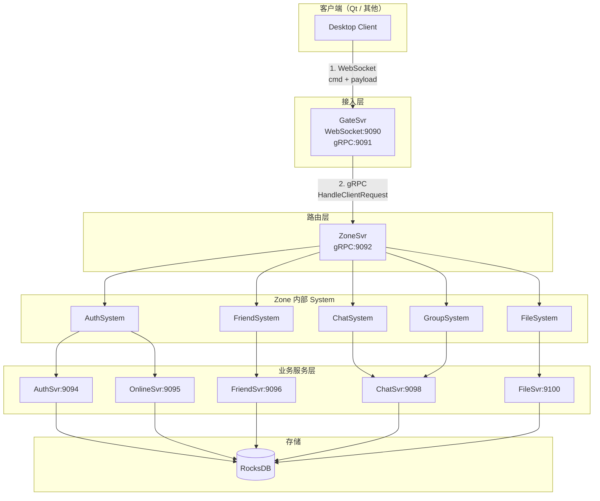
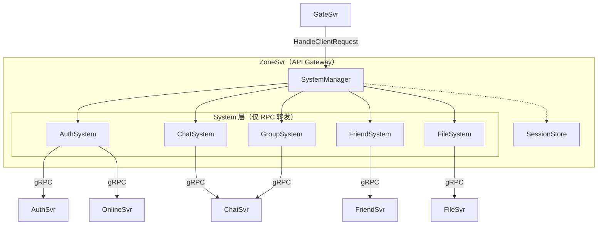
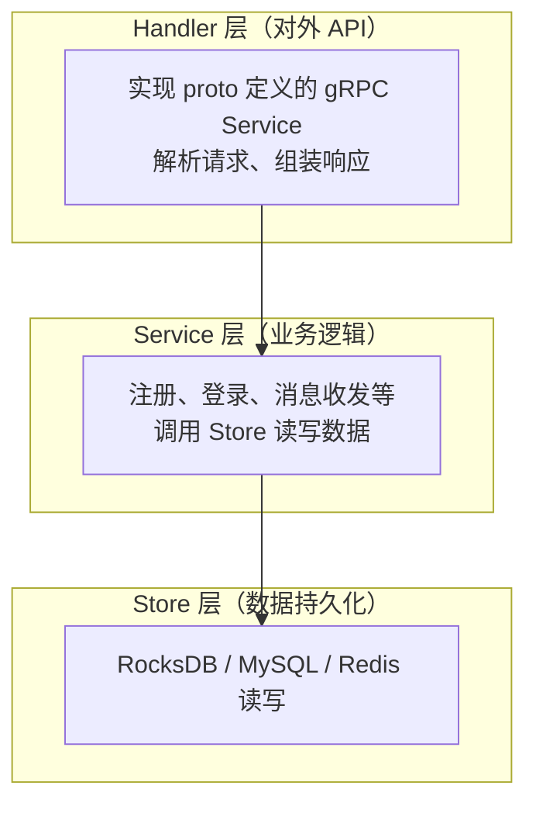

# 高性能 C++ 社交平台微服务架构设计

> 本文是 SwiftChatSystem 后端系列博客的第一篇，从整体架构视角介绍这一 C++ 微服务社交系统的设计思路与核心组件。

---

## 一、项目目标与定位

SwiftChatSystem 致力于构建一个**功能完整、高性能、可演示**的类 QQ 实时社交系统。不同于常见的「玩具级」聊天 Demo，本项目在以下方面有明确考量：

| 维度 | 说明 |
|------|------|
| **产品闭环** | 私聊、群聊、好友、富媒体、已读回执、离线推送等功能完整，可现场演示 |
| **技术深度** | C++17 系统编程 + 微服务拆解 + 云原生部署（Kubernetes） |
| **工程规范** | gRPC IDL 定义接口、CMake 构建、配置与代码分离 |
| **可扩展性** | 单机 RocksDB 起步，预留 MySQL / Redis / MinIO 的演进路径 |

换言之，它既是一个可跑起来的「成品」，也是一份可复用的微服务架构实践样本。

---

## 二、整体架构：请求如何「走一圈」

客户端发出一条消息、发起一次好友申请，请求要经过哪些组件？我们可以用一句话概括：

> **客户端 → GateSvr（WebSocket）→ ZoneSvr（路由）→ 某 System → 后端 gRPC 服务 → 返回**

下面用 Mermaid 流程图更直观地展示这一链路：



**请求流转的六个步骤：**

1. **Client → GateSvr**：通过 WebSocket 发送 `{ cmd, payload }`，例如 `{ cmd: "chat.send_message", payload: "..." }`
2. **GateSvr → ZoneSvr**：Gate 将请求通过 gRPC 转发到 Zone 的 `HandleClientRequest`
3. **ZoneSvr 分发**：根据 `cmd` 前缀（如 `auth.`、`chat.`、`friend.`）选择对应的 System
4. **System → 后端服务**：System 不实现业务逻辑，仅作为 RPC 转发层，调用 AuthSvr、ChatSvr 等
5. **后端服务处理**：执行真正的业务逻辑并访问 Store（如 RocksDB）
6. **原路返回**：结果沿 Zone → Gate → Client 返回

可以把 **Gate** 理解为「前台」，**Zone** 是「调度中心」，**System** 是「接线员」，**后端 Svr** 才是「办事的科室」。客户端只和前台打交道，前台把事交给调度中心，调度中心再转给对应的科室处理。

---

## 三、Zone-System 模式：为何需要「中间一层」

如果客户端直接连各个业务服务，会面临鉴权、路由、限流分散在各处、难以统一管理的问题。SwiftChatSystem 采用 **Zone-System 模式**，让 ZoneSvr 成为**唯一业务入口**：



**核心约定：**

- **System 只做转发**：不写业务逻辑，不直接访问数据库
- **实际逻辑在后端**：AuthSvr、ChatSvr 等负责存储与业务规则
- **SessionStore 在 Zone**：用于记录「谁连在哪个 Gate」，方便消息路由

这样带来的好处是：鉴权、限流、日志可以集中在 Zone；后端服务可以独立扩容；业务变更只需改后端，Zone 和 System 保持稳定。

SystemManager 的职责在代码中有明确注释：

```cpp
/**
 * 架构说明（API Gateway 模式）：
 *
 *   GateSvr
 *      │
 *      ▼
 *   ZoneSvr (统一入口)
 *      │
 *      ├── AuthSystem ──(RPC)──→ AuthSvr (实际逻辑)
 *      ├── ChatSystem ──(RPC)──→ ChatSvr (实际逻辑)
 *      ├── FriendSystem ──(RPC)──→ FriendSvr (实际逻辑)
 *      ├── GroupSystem ──(RPC)──→ ChatSvr/GroupService
 *      └── FileSystem ──(RPC)──→ FileSvr (实际逻辑)
 *
 * System 只负责 RPC 转发，实际业务逻辑在后端服务中实现。
 */
```

---

## 四、七个后端服务及其职责

| 服务 | 端口 | 职责简述 |
|------|------|----------|
| **GateSvr** | WS 9090 / gRPC 9091 | WebSocket 连接管理、协议解析、心跳、将请求转发到 Zone |
| **ZoneSvr** | gRPC 9092 | 统一入口、cmd 分发、在线状态与消息路由 |
| **AuthSvr** | gRPC 9094 | 注册、密码校验（VerifyCredentials）、用户资料（GetProfile / UpdateProfile） |
| **OnlineSvr** | gRPC 9095 | 登录会话、JWT 签发、ValidateToken、单设备策略 |
| **FriendSvr** | gRPC 9096 | 好友关系、分组、黑名单 |
| **ChatSvr** | gRPC 9098 | 消息收发、群组、离线队列、@ 提醒、已读回执 |
| **FileSvr** | gRPC 9100 / HTTP 8080 | 文件元数据、分块上传、HTTP 下载 |

**认证链路说明**：AuthSvr 负责「你是谁」（身份与资料），OnlineSvr 负责「你已登录」（会话与 Token）。登录流程是：先调 AuthSvr.VerifyCredentials 校验账号密码，再调 OnlineSvr.Login 获取 JWT。

---

## 五、三层结构：Handler → Service → Store

各业务服务（AuthSvr、ChatSvr 等）内部采用统一的分层结构：**无独立 API 层**，Handler 直接实现 gRPC 接口。



以 AuthSvr 为例，各层职责如下：

**1. Handler 层**：对接 gRPC，转发到 Service

```cpp
/**
 * 对外 API 层（Handler）
 * 直接实现 proto 定义的 gRPC AuthService
 * 接口：Register、VerifyCredentials、GetProfile、UpdateProfile。
 */
class AuthHandler : public AuthService::Service {
public:
  AuthHandler(std::shared_ptr<AuthServiceCore> service,
              const std::string& jwt_secret);

  ::grpc::Status Register(::grpc::ServerContext* context,
                          const RegisterRequest* request,
                          RegisterResponse* response) override;
  ::grpc::Status VerifyCredentials(...) override;
  ::grpc::Status GetProfile(...) override;
  ::grpc::Status UpdateProfile(...) override;

private:
  std::shared_ptr<AuthServiceCore> service_;
  std::string jwt_secret_;
};
```

**2. Service 层**：实现业务逻辑，调用 Store

```cpp
/**
 * 认证服务业务逻辑（身份 + 资料；登录/登出/Token 统一走 OnlineSvr）
 */
class AuthServiceCore {
public:
  explicit AuthServiceCore(std::shared_ptr<UserStore> store);

  RegisterResult Register(const std::string& username,
                          const std::string& password,
                          const std::string& nickname, ...);
  VerifyCredentialsResult VerifyCredentials(const std::string& username,
                                            const std::string& password);
  std::optional<AuthProfile> GetProfile(const std::string& user_id);
  UpdateProfileResult UpdateProfile(const std::string& user_id, ...);

private:
  std::shared_ptr<UserStore> store_;
};
```

**3. Store 层**：抽象存储接口，提供 RocksDB 实现

```cpp
/**
 * 用户存储接口
 * RocksDB Key 设计：
 *   user:{user_id}       -> UserData (JSON)
 *   username:{username}  -> user_id (用于登录查询)
 */
class UserStore {
public:
  virtual bool Create(const UserData& user) = 0;
  virtual std::optional<UserData> GetById(const std::string& user_id) = 0;
  virtual std::optional<UserData> GetByUsername(const std::string& username) = 0;
  virtual bool Update(const UserData& user) = 0;
  virtual bool UsernameExists(const std::string& username) = 0;
};

class RocksDBUserStore : public UserStore { /* ... */ };
```

Handler 只做「收包 → 调 Service → 填 response」，不关心存储细节；Service 只依赖 Store 接口，可随时切换实现（如从 RocksDB 迁到 MySQL）。

---

## 六、技术选型详解

下表汇总项目中用到的主要技术，并说明各自的职责与选型考量。

| 技术 | 在项目中的职责 | 选型考量 |
|------|----------------|----------|
| **C++17** | 后端全部服务的实现语言 | 兼顾性能与开发效率；`std::optional`、`std::shared_ptr` 等现代特性简化业务代码；与 gRPC、RocksDB 等 C++ 生态天然兼容 |
| **gRPC + Protobuf** | 服务间 RPC 通信与接口定义 | 强类型、代码生成减少手写序列化；HTTP/2 多路复用，适合高并发；与 WebSocket 配合：客户端用 WS，后端内部用 gRPC |
| **Protobuf（二进制）** | 客户端与 Gate 之间的消息编码 | 体积小、解析快，与后端协议统一；便于后续扩展字段而不破坏兼容 |
| **Boost.Beast** | GateSvr 的 WebSocket 实现 | 基于 Asio 的异步 I/O，与 C++ 生态一致；功能完善、文档丰富；无需引入额外语言运行时 |
| **RocksDB** | 用户、会话、消息、好友、文件元数据等持久化 | 嵌入式 KV，无需单独部署 DB 进程，开发/演示友好；支持 WriteBatch 原子写、前缀迭代；后续可渐进迁移到 MySQL，Store 接口保持不变 |
| **Redis**（集群模式） | ZoneSvr 的 SessionStore、Gate 注册、离线队列 | 支持多 Zone 副本共享会话状态；天然支持 TTL、List 等结构；单机开发可先用内存实现替代 |
| **AsyncLogger** | 各服务的日志输出 | 自研异步日志：双缓冲 + 后台线程刷盘，不阻塞业务；可独立复用至其他 C++ 项目；无网络开销，部署简单 |
| **JWT（HS256）** | 登录态凭证的签发与校验 | 无状态、易水平扩展；OnlineSvr 签发，业务服务本地验签即可，无需每次查库；HS256 对单机/小规模足够，大规模可考虑 RS256 |
| **nlohmann/json** | Store 层数据序列化（UserData、MessageData 等） | 头文件库，集成简单；与 Protobuf 分工：RPC 用 proto，存储用 JSON 便于人工排查 |
| **OpenSSL** | JWT 签名、密码哈希等加解密 | 业界标准，系统或 vcpkg 易获取；用于 HMAC-SHA256、密码哈希等基础能力 |
| **CMake + vcpkg** | 构建系统与依赖管理 | CMake 跨平台；vcpkg 统一管理 grpc、protobuf、rocksdb、boost 等，避免手动编译 |
| **Docker** | 单机与多机部署 | 镜像封装运行时，环境一致；Compose 一键拉起多服务，便于演示与交付 |
| **Kubernetes（Minikube）** | 集群部署与多副本编排 | 模拟生产环境；支持多 Gate/Zone 副本、Headless Service 做 gRPC 负载均衡；为后续 HPA、监控等预留 |
| **KeyValue Config（.conf + 环境变量）** | 各服务配置加载 | 配置与代码分离；环境变量覆盖便于容器注入敏感项（如 jwt_secret）；key=value 格式简单易读 |

**补充说明：**

- **为何用 WebSocket 而非 HTTP 轮询？** 实时消息需要服务端主动推送，WebSocket 长连接天然支持双向通信，减少轮询带来的延迟与开销。
- **为何拆 AuthSvr 与 OnlineSvr？** 身份（注册、密码、资料）与会话（登录、Token、单设备）职责不同，拆分后各自可独立扩容与演进。
- **为何 Store 用接口抽象？** 便于从 RocksDB 迁移到 MySQL/Redis，业务层无需改动，只需替换 Store 实现。

---

## 七、小结

SwiftChatSystem 的整体架构可以归纳为：

1. **Gate → Zone → System → 后端 gRPC**：请求链路清晰，职责边界明确
2. **Zone-System 模式**：统一入口、按 cmd 分发，System 仅做 RPC 转发
3. **七服务分工**：Gate 接入、Zone 路由、Auth/Online 认证、Friend/Chat/File 业务
4. **Handler → Service → Store**：业务服务内分层统一，便于扩展与替换实现

后续博客将分别深入 Protobuf 协议、配置与公共库、GateSvr、ZoneSvr 以及各业务服务的实现细节，敬请期待。
