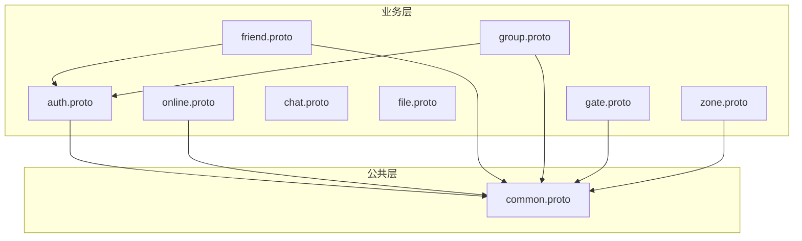
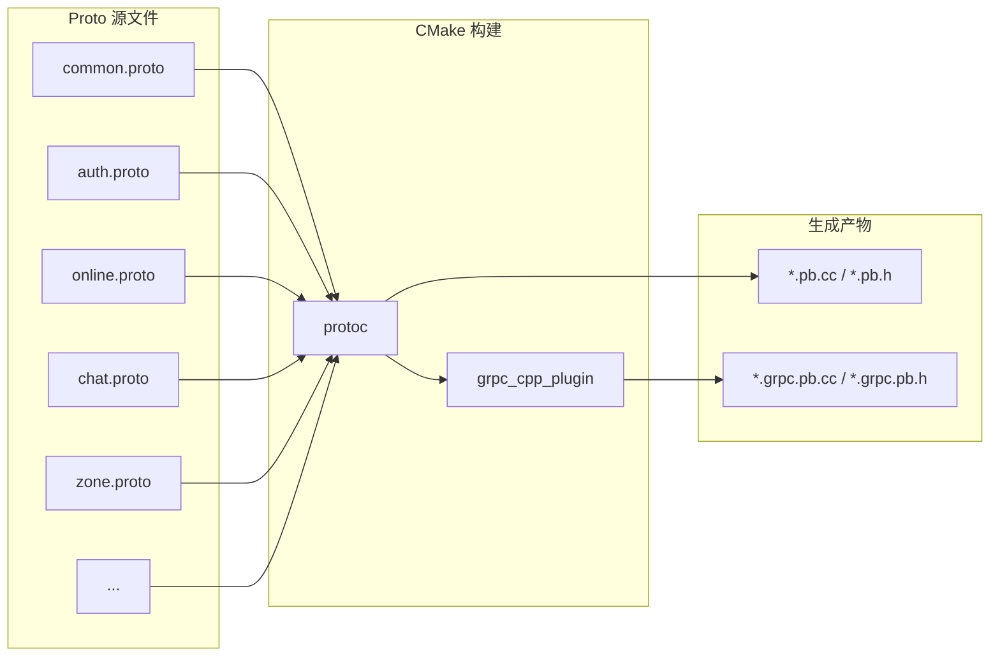

# 社交系统后端：Protobuf 协议统一设计实践

> 本文是 SwiftChatSystem 后端系列博客的第二篇，介绍 Protobuf 与 gRPC 在微服务间的协议设计、目录组织、错误码规范以及 CMake 下的生成与依赖管理。

---

## 一、为何统一协议设计至关重要

在微服务架构中，各服务通过 gRPC 互相调用。如果每个服务各自定义一套请求/响应格式和错误码，会出现：

- **重复劳动**：每个 Response 都手写 `code`、`message`，风格不一
- **难以排查**：错误码分散，同一类问题在不同服务用不同数字表示
- **升级困难**：修改一处协议可能牵连多个服务，兼容性难以保证

SwiftChatSystem 的做法是：**把通用部分抽到 `common.proto`，各业务 proto 按需引用；错误码在 C++ 侧集中定义，通过 `ErrorCodeToInt` 填入 proto 的 `code` 字段**。这样既能保持接口风格统一，又便于后续演进。

---

## 二、Proto 目录与引用关系

### 2.1 文件布局

Proto 文件按**服务归属**散落在各模块目录下，由 `backend/common/proto/CMakeLists.txt` 统一收集并生成：

```
backend/
├── common/proto/
│   └── common.proto          # 公共类型，被所有业务 proto 引用
├── authsvr/proto/
│   └── auth.proto
├── onlinesvr/proto/
│   └── online.proto
├── friendsvr/proto/
│   └── friend.proto
├── chatsvr/proto/
│   ├── chat.proto
│   └── group.proto           # 群组与 chat 同属 ChatSvr
├── filesvr/proto/
│   └── file.proto
├── gatesvr/proto/
│   └── gate.proto
└── zonesvr/proto/
    └── zone.proto
```

**设计原则**：每个服务「拥有」自己的 proto，`common.proto` 作为**被依赖方**不依赖任何业务 proto。

### 2.2 引用关系图

用 Mermaid 可以直观展示 import 依赖：



**要点**：

- **common** 是底层，无业务依赖
- **auth、online、gate、zone** 直接引用 common，用于 `CommonResponse` 等
- **friend** 和 **group** 需要 `UserProfile` 等结构，故引用 `auth.proto`
- **chat.proto** 和 **file.proto** 自有一套 Response 结构（含 `code`、`message` + 业务字段），暂不引用 common；与 common 的约定在语义上一致即可

---

## 三、common.proto：通用类型的「地基」

`common.proto` 定义了各服务共用的基础类型，相当于协议层的「地基」。

### 3.1 CommonResponse：最简单的结果包装

多数「只返回成功/失败」的 RPC（如删除好友、更新资料），直接复用 `CommonResponse`：

```protobuf
syntax = "proto3";

package swift.common;

// 通用响应
message CommonResponse {
    int32 code = 1;           // 状态码：0=成功
    string message = 2;       // 错误信息
}
```

业务 proto 中通过 `swift.common.CommonResponse` 引用，例如：

```protobuf
// auth.proto
service AuthService {
    rpc UpdateProfile(UpdateProfileRequest) returns (swift.common.CommonResponse);
}

// friend.proto
service FriendService {
    rpc AddFriend(AddFriendRequest) returns (swift.common.CommonResponse);
    rpc RemoveFriend(RemoveFriendRequest) returns (swift.common.CommonResponse);
    // ...
}

// gate.proto - Zone 调用 Gate 推送消息
service GateInternalService {
    rpc PushMessage(PushMessageRequest) returns (swift.common.CommonResponse);
    rpc DisconnectUser(DisconnectUserRequest) returns (swift.common.CommonResponse);
}
```

这样，凡是「仅需 code + message」的接口，都无需再定义各自的 Response 类型。

### 3.2 PageRequest / PageResponse：分页约定

列表类接口（好友列表、群成员、历史消息）通常需要分页。`common.proto` 提供两种分页模型：

```protobuf
// 分页请求
message PageRequest {
    int32 page = 1;
    int32 page_size = 2;
    string cursor = 3;        // 游标分页
}

// 分页响应
message PageResponse {
    int32 total = 1;
    bool has_more = 2;
    string next_cursor = 3;
}
```

- **page + page_size**：传统页码分页，适合总数已知、需跳页的场景
- **cursor + next_cursor**：游标分页，适合大列表、流式拉取（如离线消息、历史消息），避免偏移量过大导致的性能问题

业务 proto 可在自己的 Request/Response 中嵌入或参考这两个结构，例如 `PullOfflineRequest` 使用 `limit` + `cursor`，`PullOfflineResponse` 返回 `next_cursor`、`has_more`。

### 3.3 Timestamp：时间表示

```protobuf
message Timestamp {
    int64 seconds = 1;
    int32 nanos = 2;
}
```

与 Google 的 `google.protobuf.Timestamp` 对齐，便于将来与标准类型互转。当前实现中，不少地方直接用 `int64` 毫秒时间戳，`Timestamp` 作为预留扩展。

---

## 四、请求/响应结构与命名约定

### 4.1 基本模式

各业务 proto 的 Request/Response 遵循统一模式：

| 类型 | 命名 | 说明 |
|------|------|------|
| 请求 | `XxxRequest` | 与 RPC 方法一一对应 |
| 简单响应 | `CommonResponse` | 仅 code + message |
| 带业务数据的响应 | `XxxResponse` | 包含 `code`、`message` + 业务字段 |

**带业务数据的 Response 示例**（`RegisterResponse`）：

```protobuf
message RegisterResponse {
    int32 code = 1;
    string message = 2;
    string user_id = 3;       // 业务字段
}

message VerifyCredentialsResponse {
    int32 code = 1;
    string message = 2;
    string user_id = 3;
    UserProfile profile = 4;  // 业务字段
}
```

**约定**：所有 Response 的 `code`、`message` 含义一致——`code == 0` 表示成功，非零为错误码；`message` 为人类可读说明，便于排查。

### 4.2 避免命名冲突

Proto 的 package 与 C++ namespace 对应，但若多个 proto 中出现同名 message（如 `Group`），可能产生冲突。本项目的做法是：

- **friend.proto**：好友分组命名为 `FriendGroup`，好友请求命名为 `FriendRequestInfo`，以区分群组相关类型
- **group.proto**：群组相关类型使用 `GroupInfo`、`GroupMember` 等

这样同一编译单元内不会出现类型名冲突。

### 4.3 客户端与 Zone 的「信封」协议

客户端与 Gate 之间通过 WebSocket 收发消息，需要一层「信封」包装。`gate.proto` 定义：

```protobuf
// 客户端发送
message ClientMessage {
    string cmd = 1;            // 命令类型，如 auth.login、chat.send_message
    bytes payload = 2;         // 具体消息体（Protobuf 序列化）
    string request_id = 3;     // 请求 ID，用于响应匹配
}

// 服务端返回
message ServerMessage {
    string cmd = 1;
    bytes payload = 2;
    string request_id = 3;
    int32 code = 4;            // 0=成功
    string message = 5;
}
```

`HandleClientRequestRequest` 则把 cmd、payload、token 等从 Gate 传到 Zone，形成「客户端 → Gate → Zone」的统一协议风格：

```protobuf
message HandleClientRequestRequest {
    string conn_id = 1;
    string user_id = 2;
    string cmd = 3;            // auth.login、chat.send_message、friend.add ...
    bytes payload = 4;
    string request_id = 5;
    string token = 6;
}

message HandleClientRequestResponse {
    int32 code = 1;
    string message = 2;
    bytes payload = 3;         // 业务返回体
    string request_id = 4;
}
```

---

## 五、错误码规范

### 5.1 为何需要集中定义

Proto 的 `code` 是 `int32`，若各服务自行约定数值，很容易重叠或冲突。SwiftChatSystem 在 C++ 侧集中定义 `ErrorCode` 枚举，通过 `ErrorCodeToInt()` 填入 proto，实现「一处定义、处处一致」。

### 5.2 错误码分段规则

```cpp
/**
 * 编码规则：
 *   0        - 成功
 *   1-99     - 通用错误
 *   100-199  - 认证错误 (AuthSvr)
 *   200-299  - 好友错误 (FriendSvr)
 *   300-399  - 消息错误 (ChatSvr)
 *   400-499  - 文件错误 (FileSvr)
 *   500-599  - 群组错误 (ChatSvr)
 *   600-699  - 网关错误 (GateSvr)
 *   700-799  - 路由错误 (ZoneSvr)
 *   800-899  - 存储错误
 *   900-999  - 网络/RPC错误
 */
```

分段的好处：

- **按服务定位**：看到 2xx 就知道是好友相关，3xx 是消息相关
- **便于扩展**：每个区间留有余量，新增错误码不破坏已有约定
- **跨服务一致**：Zone 调用 AuthSvr 失败时返回 1xx，调用 FriendSvr 失败时返回 2xx，客户端可据此做差异化提示

### 5.3 使用方式

Handler 层在组包时调用：

```cpp
response->set_code(swift::ErrorCodeToInt(swift::ErrorCode::OK));
response->set_message(swift::ErrorCodeToString(swift::ErrorCode::OK));

// 失败时
response->set_code(swift::ErrorCodeToInt(swift::ErrorCode::TOKEN_INVALID));
response->set_message(swift::ErrorCodeToString(swift::ErrorCode::TOKEN_INVALID));
```

`ErrorCodeToString` 提供英文描述，便于日志与调试；面向用户的提示可在客户端根据 `code` 做本地化映射。

---

## 六、CMake 中的 Proto 生成与依赖管理

### 6.1 生成流程概览



### 6.2 关键 CMake 配置

```cmake
# 定义 proto 文件列表（按依赖顺序，common 最先）
set(PROTO_FILES
    ${BACKEND_DIR}/common/proto/common.proto
    ${BACKEND_DIR}/authsvr/proto/auth.proto
    ${BACKEND_DIR}/chatsvr/proto/chat.proto
    ${BACKEND_DIR}/chatsvr/proto/group.proto
    ${BACKEND_DIR}/friendsvr/proto/friend.proto
    ${BACKEND_DIR}/filesvr/proto/file.proto
    ${BACKEND_DIR}/gatesvr/proto/gate.proto
    ${BACKEND_DIR}/onlinesvr/proto/online.proto
    ${BACKEND_DIR}/zonesvr/proto/zone.proto
)

# Proto 搜索路径（import 时按此顺序查找）
set(PROTO_PATHS
    ${BACKEND_DIR}/common/proto
    ${BACKEND_DIR}/authsvr/proto
    ${BACKEND_DIR}/chatsvr/proto
    ...
)

# 每个 proto 生成 4 个文件
add_custom_command(
    OUTPUT ${PROTO_OUTPUT_DIR}/${PROTO_NAME}.pb.cc
          ${PROTO_OUTPUT_DIR}/${PROTO_NAME}.pb.h
          ${PROTO_OUTPUT_DIR}/${PROTO_NAME}.grpc.pb.cc
          ${PROTO_OUTPUT_DIR}/${PROTO_NAME}.grpc.pb.h
    COMMAND ${Protobuf_PROTOC_EXECUTABLE}
        --proto_path=...
        --cpp_out=${PROTO_OUTPUT_DIR}
        --grpc_out=${PROTO_OUTPUT_DIR}
        --plugin=protoc-gen-grpc=${GRPC_CPP_PLUGIN}
        ${PROTO_FILE}
    ...
)
```

**要点**：

- `--proto_path` 必须覆盖所有被 import 的 proto 所在目录
- 使用 `add_custom_command` 保证 proto 变更时重新生成
- 生成的 `.pb.cc`、`.grpc.pb.cc` 被打包成 `swift_proto` 静态库，各服务链接该库即可

### 6.3 依赖关系

```
swift_proto (静态库)
    ├── common.pb.cc / common.grpc.pb.cc   (无 gRPC service，仅 message)
    ├── auth.pb.cc / auth.grpc.pb.cc
    ├── online.pb.cc / online.grpc.pb.cc
    └── ...

authsvr, onlinesvr, friendsvr, ...  →  link swift_proto
```

`common.proto` 只定义 message，不定义 service，故 `common.grpc.pb.cc` 主要是空实现或占位；有 service 的 proto 会生成 `XxxService::Stub` 等 gRPC 客户端/服务端代码。

---

## 七、协议演进与兼容性

### 7.1 Proto3 的兼容规则

- **新增字段**：使用新 field number，旧客户端忽略未知字段，兼容
- **删除字段**：不要复用其 field number，避免旧客户端填错
- **修改类型**：易破坏兼容，应避免；若必须修改，可考虑新增 message 或新 RPC

### 7.2 本项目的实践

- **预留 field number**：如 `message UserProfile` 中 `gender` 用 6，后面可继续 7、8
- **oneof 扩展**：`file.proto` 的 `UploadChunk` 使用 `oneof data`，便于后续增加新的上传模式
- **可选字段**：Proto3 的 `optional` 或「不设 required」使多数字段可选，便于渐进式填充

---

## 八、小结

SwiftChatSystem 的 Protobuf 与 gRPC 协议设计可归纳为：

1. **common.proto 作为地基**：CommonResponse、PageRequest/PageResponse、Timestamp 等通用类型统一复用
2. **按服务拆分 proto**：各服务拥有自己的 proto，通过 import 表达依赖，避免循环引用
3. **请求/响应命名约定**：`XxxRequest`、`XxxResponse`，简单场景用 `CommonResponse`
4. **错误码集中管理**：C++ 侧 `ErrorCode` 分段定义，通过 `ErrorCodeToInt`/`ErrorCodeToString` 与 proto 衔接
5. **CMake 统一生成**：`swift_proto` 库集中产出，各服务只依赖该库

下一篇文章将介绍配置管理、JWT、gRPC 鉴权等公共库的实现，敬请期待。
