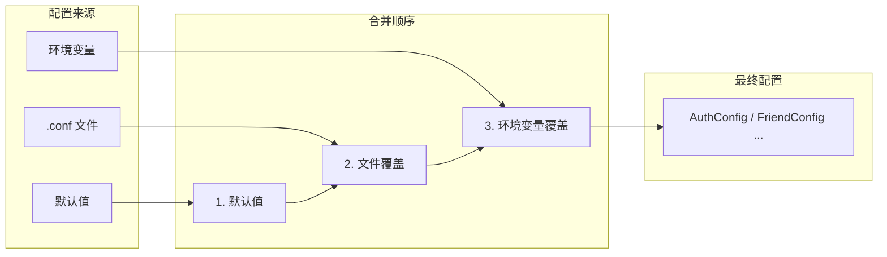
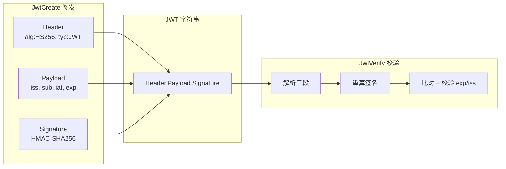
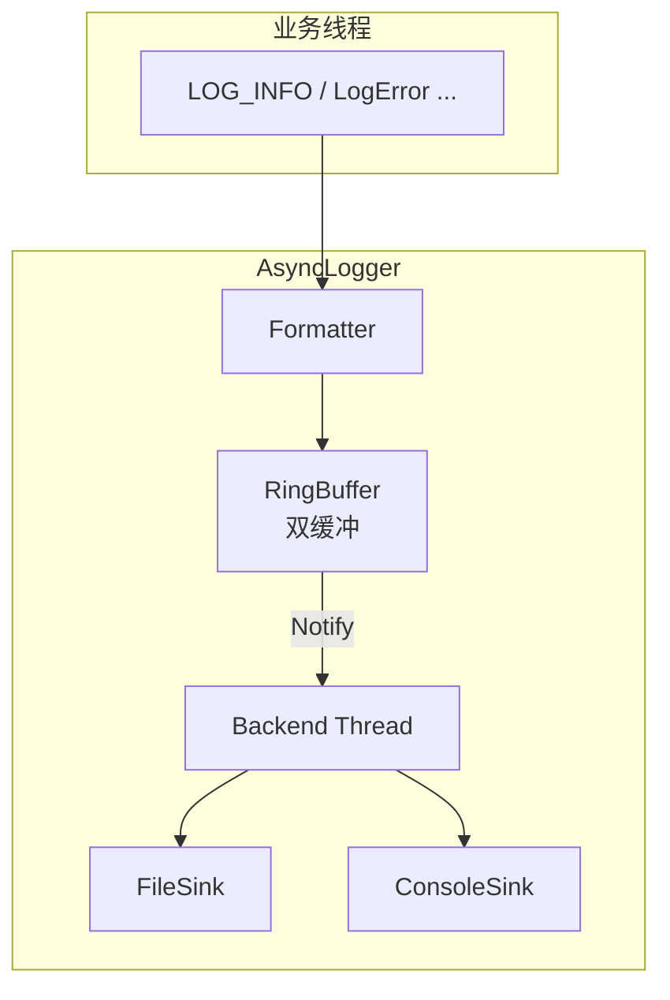

# C++ 微服务中的配置加载与通用基础设施

> 本文是 SwiftChatSystem 后端系列博客的第三篇，介绍配置管理、JWT、gRPC 鉴权、日志以及工具函数等公共基础设施的设计与用法。

---

## 一、为何需要统一的配置与公共库

微服务架构下，各服务会反复用到同类能力：加载配置、签发与校验 Token、记录日志、生成 ID、计算哈希等。若每个服务各自实现，会导致：

- **重复代码**：同样的配置解析、JWT 逻辑散落各处
- **行为不一致**：密钥格式、错误处理方式不统一
- **维护成本高**：改一处逻辑要改多个服务

SwiftChatSystem 将这类能力抽到 `backend/common`，各服务只需调用公共接口。本文围绕**配置加载**、**JWT**、**gRPC 鉴权**、**日志**和**工具函数**展开。

---

## 二、配置加载：.conf + 环境变量覆盖

### 2.1 设计目标

配置需要满足：

- **多环境**：开发、测试、生产用不同端口、路径
- **容器友好**：Docker/K8s 通过环境变量注入，无需挂载配置
- **敏感隔离**：密钥等不写进仓库，仅由环境变量提供

本项目采用 **key=value 配置文件 + 环境变量按前缀覆盖** 的方案。

### 2.2 配置加载流程



**约定**：环境变量优先级最高，文件次之，代码中的默认值兜底。这样容器部署时，只需设置环境变量即可覆盖敏感项和地址。

### 2.3 KeyValueConfig 与 LoadKeyValueConfig

公共库提供 `KeyValueConfig` 与 `LoadKeyValueConfig`：

```cpp
// config_loader.h
class KeyValueConfig {
public:
    void LoadFile(const std::string& path);           // 解析 key=value 文件
    void ApplyEnvOverrides(const std::string& env_prefix);  // 环境变量覆盖
    void Load(const std::string& path, const std::string& env_prefix);

    std::string Get(const std::string& key, const std::string& default_val) const;
    int GetInt(const std::string& key, int default_val) const;
    int64_t GetInt64(const std::string& key, int64_t default_val) const;
    bool GetBool(const std::string& key, bool default_val) const;
    // ...
};

KeyValueConfig LoadKeyValueConfig(const std::string& path,
                                 const std::string& env_prefix);
```

**环境变量覆盖规则**：只处理以 `env_prefix` 开头的变量，去掉前缀并转小写后作为 key。例如 `AUTHSVR_PORT=9095` 会覆盖 `port`。

```cpp
// ApplyEnvOverrides 核心逻辑（节选）
// prefix="AUTHSVR_"，环境变量 AUTHSVR_GRPC_PORT=9101
// 则 key = "grpc_port", value = "9101"
if (name_upper.compare(0, plen, prefix_upper) == 0) {
    std::string key = name_upper.substr(plen);  // "GRPC_PORT" -> "grpc_port"
    map_[ToLowerKey(key)] = value;
}
```

**文件格式**：支持 `#` 注释、空行，`key=value` 等号两侧空白会被 trim：

```ini
# authsvr.conf.example
host=0.0.0.0
port=9094
store_type=rocksdb
rocksdb_path=/data/auth
jwt_secret=swift_online_secret_2026
log_dir=/data/logs
log_level=INFO
```

### 2.4 各服务如何使用

以 AuthSvr 为例，配置加载封装在 `LoadConfig` 中：

```cpp
// authsvr/internal/config/config.cpp
AuthConfig LoadConfig(const std::string& config_file) {
    swift::KeyValueConfig kv = swift::LoadKeyValueConfig(config_file, "AUTHSVR_");

    AuthConfig config;
    config.host = kv.Get("host", "0.0.0.0");
    config.port = kv.GetInt("port", 9094);
    config.store_type = kv.Get("store_type", "rocksdb");
    config.rocksdb_path = kv.Get("rocksdb_path", "/data/auth");
    config.jwt_secret = kv.Get("jwt_secret", "swift_online_secret_2026");
    config.log_dir = kv.Get("log_dir", "/data/logs");
    config.log_level = kv.Get("log_level", "INFO");

    return config;
}
```

main 中优先用环境变量指定配置文件路径：

```cpp
// authsvr/cmd/main.cpp
std::string config_file = (argc > 1) ? argv[1] : "";
if (config_file.empty()) {
    const char* env = std::getenv("AUTHSVR_CONFIG");
    config_file = env ? env : "authsvr.conf";
}
swift::auth::AuthConfig config = swift::auth::LoadConfig(config_file);
```

**各服务环境变量前缀**（来自 config/README.md）：

| 服务    | 前缀       | 示例                     |
|---------|------------|--------------------------|
| AuthSvr | AUTHSVR_   | AUTHSVR_PORT=9094        |
| OnlineSvr | ONLINESVR_ | ONLINESVR_JWT_SECRET=xxx |
| FriendSvr | FRIENDSVR_ | FRIENDSVR_ROCKSDB_PATH=/data/friend |
| ChatSvr | CHATSVR_   | CHATSVR_PORT=9098        |
| FileSvr | FILESVR_   | FILESVR_STORAGE_PATH=... |
| GateSvr | GATESVR_   | GATESVR_WEBSOCKET_PORT=9090 |
| ZoneSvr | ZONESVR_   | ZONESVR_PORT=9092        |

---

## 三、JWT 实现：签发与校验

### 3.1 为何需要 JWT

登录成功后，服务端需要一种「无状态」的凭证，让客户端在后续请求中证明身份。JWT（JSON Web Token）把用户 ID、过期时间等编码进 Token，服务端用密钥验签即可，无需每次查库。本项目采用 **HS256**（HMAC-SHA256），适合单机或小规模场景；大规模可考虑 RS256 等非对称算法。

### 3.2 JWT 结构与流程



**标准格式**：`Base64Url(Header).Base64Url(Payload).Base64Url(Signature)`。JWT 使用 Base64Url（`+`→`-`，`/`→`_`，去掉 `=`），便于 URL 和 HTTP Header 传输。

### 3.3 JwtCreate 与 JwtVerify

```cpp
// jwt_helper.h
std::string JwtCreate(const std::string& user_id,
                      const std::string& secret,
                      int expire_hours = 24 * 7,
                      const std::string& issuer = "swift-online");

JwtPayload JwtVerify(const std::string& token, const std::string& secret);

struct JwtPayload {
    std::string user_id;   // sub
    std::string issuer;    // iss
    int64_t iat;
    int64_t exp;
    bool valid;
};
```

**签发流程**（简化）：

```cpp
// jwt_helper.cpp 核心逻辑
std::string JwtCreate(...) {
    json header = {{"alg", "HS256"}, {"typ", "JWT"}};
    json payload = {{"iss", issuer}, {"sub", user_id}, {"iat", now}, {"exp", exp}};

    std::string msg = Base64UrlEncode(header.dump()) + "." + Base64UrlEncode(payload.dump());
    std::string sig_hex = HmacSha256(secret, msg);  // OpenSSL HMAC-SHA256
    std::string sig_b64 = Base64UrlEncode(HexDecode(sig_hex));

    return msg + "." + sig_b64;
}
```

**校验流程**：解析三段 → 用相同 secret 对前两段重算 HMAC-SHA256 → 比对签名 → 解析 payload，检查 `exp`、`iss`、`sub`。本项目接受 `iss` 为 `swift-online` 或 `swift-auth`。

---

## 四、gRPC 鉴权：GetAuthenticatedUserId

### 4.1 问题背景

业务接口（如 GetProfile、添加好友、发消息）需要知道「当前用户是谁」。若直接信任请求体中的 `user_id`，恶意客户端可伪造他人身份发起越权请求。正确做法是：**以 gRPC metadata 中的 JWT 为准，服务端验签得到 user_id**。

### 4.2 约定：Metadata 中的 Token

客户端在 gRPC metadata 中携带 Token，任选其一：

- `authorization: Bearer <jwt>`
- `x-token: <jwt>`

Zone 调用后端时，会把从 Gate 传过来的 token 注入到 ClientContext：

```cpp
// rpc_client_base.cpp
context->AddMetadata("authorization", "Bearer " + token);
```

### 4.3 GetAuthenticatedUserId 的实现

```cpp
// grpc_auth.h
std::string GetAuthenticatedUserId(::grpc::ServerContext* context,
                                   const std::string& jwt_secret);
```

内部逻辑：从 metadata 取出 token → 调用 `JwtVerify` → 返回 `user_id`；失败则返回空字符串。

```cpp
// grpc_auth.cpp
std::string GetAuthenticatedUserId(...) {
    std::string token = GetTokenFromContext(context);  // 优先 authorization，其次 x-token
    if (token.empty()) return "";
    JwtPayload payload = JwtVerify(token, jwt_secret);
    if (!payload.valid) return "";
    return payload.user_id;
}
```

### 4.4 Handler 中的用法

以 AuthSvr 的 GetProfile 为例：**不信任请求体中的 user_id，只用 metadata 解析出的 uid**：

```cpp
::grpc::Status AuthHandler::GetProfile(::grpc::ServerContext* context,
                                        const GetProfileRequest* request,
                                        UserProfile* response) {
    std::string uid = swift::GetAuthenticatedUserId(context, jwt_secret_);
    if (uid.empty()) {
        return ::grpc::Status(::grpc::StatusCode::UNAUTHENTICATED,
                             "token invalid or missing");
    }
    // request->user_id() 被忽略，以 uid 为准
    auto profile = service_->GetProfile(uid);
    // ...
}
```

这样，无论请求体如何构造，服务端都以 Token 解析出的身份执行业务，有效防止越权。

---

## 五、日志：AsyncLogger 与 log_helper

### 5.1 设计目标

- **不阻塞业务**：日志写盘在后台线程
- **可复用**：AsyncLogger 作为独立组件，可用于其他 C++ 项目
- **多输出**：支持文件、控制台，可扩展远程 Sink

### 5.2 架构示意



**核心机制**：业务线程将日志条目 Push 到前台缓冲；后台线程定期与前台交换缓冲，批量刷盘。这样业务线程只做轻量写入，不直接做 I/O。

### 5.3 使用方式

各服务在 main 中通过环境变量初始化：

```cpp
if (!swift::log::InitFromEnv("authsvr")) {
    std::cerr << "Failed to initialize logger!" << std::endl;
    return 1;
}
// ...
swift::log::Shutdown();  // 进程退出前刷新
```

**InitFromEnv** 读取 `LOG_DIR`、`LOG_LEVEL`、`LOG_CONSOLE` 等环境变量，适合容器部署。业务代码使用宏：

```cpp
LogInfo(TAG("service", "authsvr"), "Register success, user_id=" << result.user_id);
LogError(TAG("service", "authsvr"), "VerifyCredentials failed: " << result.error);
```

---

## 六、工具函数：utils.h

### 6.1 分类概览

| 类别 | 典型函数 | 用途 |
|------|----------|------|
| ID 生成 | `GenerateShortId("u_", 12)` | 用户 ID、消息 ID |
| 时间 | `GetTimestampMs()`、`FormatTimestamp()` | 时间戳、格式化 |
| 哈希 | `SHA256`、`HmacSHA256`、`MD5` | 密码哈希、JWT 签名、文件校验 |
| 编码 | `Base64Encode`、`HexEncode`、`UrlEncode` | 序列化、URL 安全 |
| 字符串 | `Split`、`Join`、`Trim`、`StartsWith` | 解析、格式化 |
| 类型转换 | `ToInt32`、`ToInt64`、`ToDouble` | 配置解析 |

### 6.2 在业务中的使用

AuthSvr 注册时生成 user_id、哈希密码、记录时间：

```cpp
// auth_service.cpp
std::string user_id = swift::utils::GenerateShortId("u_", 12);   // "u_7kX9mPqR3sT1"
std::string password_hash = swift::utils::SHA256(password + kPasswordSalt);
int64_t now = swift::utils::GetTimestampMs();
```

JWT 内部依赖 `GetTimestampMs` 计算 iat/exp，以及 `HmacSHA256`、`Base64UrlEncode`、`HexDecode` 等（部分在 jwt_helper 内实现，部分复用 utils）。

### 6.3 工具函数的价值

将 ID 生成、时间、哈希等集中到 `utils`，业务代码保持简洁，且便于单元测试与 mock。例如更换 ID 算法时，只需修改 `GenerateShortId` 一处。

---

## 七、小结

SwiftChatSystem 的配置与公共基础设施可归纳为：

1. **配置**：`KeyValueConfig` + `LoadKeyValueConfig`，支持 .conf 与环境变量按前缀覆盖，各服务 `LoadConfig` 只做键到结构体的映射
2. **JWT**：`JwtCreate`、`JwtVerify`（HS256、Base64Url），OnlineSvr 签发，业务服务校验
3. **gRPC 鉴权**：`GetAuthenticatedUserId` 从 metadata 取 Token 并验签，业务以返回的 user_id 为准，不信任请求体
4. **日志**：`swift::log::InitFromEnv` + `LogInfo`/`LogError` 等，底层为 AsyncLogger 双缓冲异步写
5. **工具函数**：`utils.h` 提供 ID、时间、哈希、编码、字符串等通用能力

下一篇文章将介绍 GateSvr 的 WebSocket 接入层实现，敬请期待。
