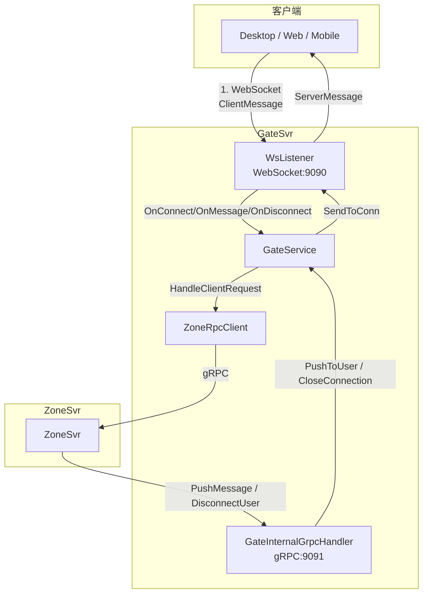
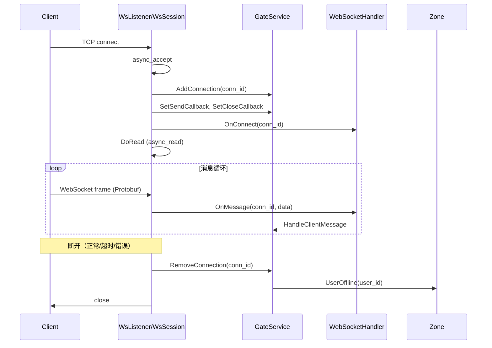
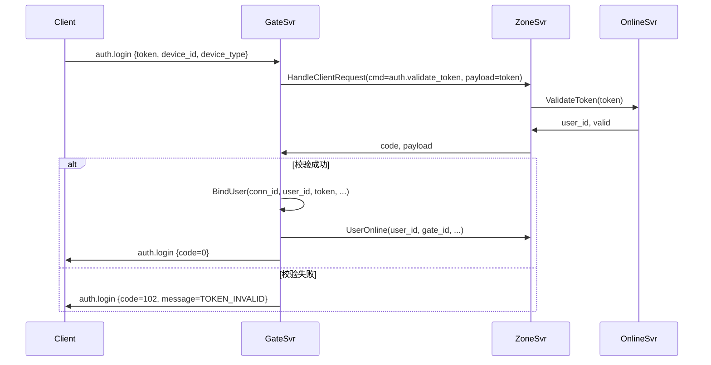

# 实时社交系统接入层：基于 Boost.Beast 的 WebSocket 网关实现

> 本文是 SwiftChatSystem 后端系列博客的第四篇，介绍 GateSvr 作为客户端接入网关的设计与实现，涵盖 WebSocket 连接管理、协议解析、心跳检测、登录流程以及 Gate 与 Zone 的协作方式。

---

## 一、GateSvr 的定位与职责

客户端（Qt 桌面、Web、移动端）需要与后端保持长连接以接收实时消息。若让客户端直接连各业务服务的 gRPC，会面临协议不统一、连接数膨胀、难以做消息推送等问题。GateSvr 作为**接入网关**，承担「唯一对外入口」的角色：

| 职责 | 说明 |
|------|------|
| **WebSocket 连接管理** | 客户端通过 WebSocket（9090）建立长连接，支持双向通信 |
| **gRPC 对内服务** | ZoneSvr 通过 gRPC（9091）调用 Gate 推送消息、断开连接 |
| **协议解析** | 解析客户端 cmd + payload（Protobuf 二进制），按 cmd 分发 |
| **心跳与超时** | 检测「假死」连接，定期向 Zone 上报 Gate 存活 |
| **登录绑定** | `auth.login` 成功后建立 conn_id ↔ user_id 映射，供后续推送与转发 |

可以把它理解为「前台」：客户端只和 Gate 打交道，Gate 负责把请求转给 Zone，把 Zone 的推送发回客户端。

---

## 二、整体架构与线程模型

### 2.1 架构示意



### 2.2 进程内的三根「线」

main 中会启动三条逻辑线：

1. **WebSocket 线程**：`boost::asio::io_context` 在独立线程运行，负责 accept、read、write
2. **gRPC 线程**：`grpc_server->Wait()` 在主线程阻塞，处理 Zone 的 PushMessage、DisconnectUser
3. **心跳线程**：每 `heartbeat_interval_seconds` 秒执行 `CheckHeartbeat`（踢掉超时连接）和 `GateHeartbeat`（向 Zone 上报存活）

```cpp
// main.cpp 节选
std::thread ws_thread([&ioc, &running]() {
    while (running) { ioc.run(); break; }
});

std::thread heartbeat_thread([&running, gate_svc, heartbeat_interval]() {
    while (running) {
        std::this_thread::sleep_for(std::chrono::seconds(heartbeat_interval));
        if (!running) break;
        gate_svc->CheckHeartbeat();   // 客户端超时检测
        gate_svc->GateHeartbeat();    // 向 Zone 上报
    }
});

grpc_server->Wait();  // 主线程
```

WebSocket 的发送可能由 gRPC 线程触发，通过 `SendCallback` + `net::post` 投递到 Asio 的 executor，保证写操作在正确的线程执行。

---

## 三、连接生命周期

### 3.1 从 Accept 到 Close



**WsSession** 在 `OnAccept` 成功后：

1. 调用 `GateService::AddConnection(conn_id)` 登记连接
2. 注册 `SendCallback`：Gate 需要向该连接发数据时，回调 `Send`，内部 `net::post` 到 Asio 线程
3. 注册 `CloseCallback`：Gate 需要踢线时，回调 `Close`，触发 Session 清理与 `RemoveConnection`
4. 调用 `OnConnect`，开始 `DoRead` 循环

**断开时**（客户端关闭、心跳超时、读写错误）：

- 调用 `RemoveConnection`，其中若该连接已绑定 user_id，会通知 Zone 的 `UserOffline`
- 关闭 WebSocket，释放 Session

### 3.2 conn_id 与 Connection 结构

每个 WebSocket 连接拥有唯一的 `conn_id`（如 `conn_1706918400000_1`），用于在 Gate 内部标识连接。登录前，只有 conn_id；登录成功后，会建立 user_id 与 conn_id 的映射。

```cpp
struct Connection {
    std::string conn_id;
    std::string user_id;       // 登录后才有
    std::string token;         // JWT，转发业务请求时带给 Zone
    std::string device_id;
    std::string device_type;
    int64_t connected_at;
    int64_t last_heartbeat;    // 用于 CheckHeartbeat
    bool authenticated = false;
};
```

GateService 维护 `connections_`（conn_id → Connection）和 `user_to_conn_`（user_id → conn_id），便于「按 user_id 推送」和「按 conn_id 发送」。

---

## 四、协议：ClientMessage 与 ServerMessage

### 4.1 信封格式

客户端与 Gate 之间使用统一的「信封」包装，具体业务内容放在 `payload`（Protobuf 序列化的 bytes）中：

```protobuf
// 客户端发送
message ClientMessage {
    string cmd = 1;            // 命令类型：auth.login、heartbeat、chat.send_message ...
    bytes payload = 2;         // 具体消息体（Protobuf 序列化）
    string request_id = 3;     // 请求 ID，用于响应匹配
}

// 服务端返回
message ServerMessage {
    string cmd = 1;
    bytes payload = 2;
    string request_id = 3;
    int32 code = 4;            // 0=成功
    string message = 5;        // 错误信息
}
```

这样，Gate 只需解析一层「cmd + payload + request_id」，无需关心每个业务的具体结构；业务细节由 Zone 及后端服务解析。

### 4.2 消息处理流程

```
WebSocket 收到二进制帧
    → Parse ClientMessage
    → 根据 cmd 分发：
        - auth.login      → HandleLogin（本机处理）
        - heartbeat       → HandleHeartbeat（本机处理）
        - chat.* / friend.* / group.* / file.*  → ForwardToZone
        - 其他            → 返回 UNSUPPORTED
```

---

## 五、登录流程：auth.login

### 5.1 为何需要「连接时登录」

WebSocket 建立后，连接与「用户」尚未绑定。客户端必须先发送 `auth.login`，携带已通过 OnlineSvr 获取的 JWT，Gate 校验通过后才建立 conn_id ↔ user_id 的映射。之后，业务请求才能携带正确的 user_id 和 token 转发给 Zone。

### 5.2 登录流程示意



**关键点**：

- Gate 不自行验 Token，而是通过 Zone 转发 `auth.validate_token` 到 OnlineSvr
- 校验成功后，Gate 调用 `BindUser` 建立映射，再调用 Zone 的 `UserOnline` 登记在线
- 之后业务请求（如 `chat.send_message`）会从 Connection 中取出 `user_id` 和 `token`，一并传给 Zone

### 5.3 代码实现要点

```cpp
void GateService::HandleLogin(const std::string& conn_id,
                              const std::string& payload,
                              const std::string& request_id) {
    swift::gate::ClientLoginRequest req;
    if (!req.ParseFromString(payload)) {
        SendResponse(conn_id, "auth.login", request_id, ...);
        return;
    }
    // 构造 auth.validate_token 请求，通过 Zone 转发
    swift::zone::AuthValidateTokenPayload validate_req;
    validate_req.set_token(req.token());
    // ...
    zone_client_->HandleClientRequest(conn_id, "", "auth.validate_token",
                                      validate_payload, request_id, "", &result);
    if (result.code != 0) {
        SendResponse(conn_id, "auth.login", request_id, result.code, result.message);
        return;
    }
    // 解析 user_id，绑定连接
    std::string user_id = validate_resp.user_id();
    BindUser(conn_id, user_id, req.token(), req.device_id(), req.device_type());
    zone_client_->UserOnline(user_id, gate_id_, req.device_type(), req.device_id());
    SendResponse(conn_id, "auth.login", request_id, 0, "OK");
}
```

---

## 六、业务请求转发：ForwardToZone

除 `auth.login` 和 `heartbeat` 外，以 `chat.`、`friend.`、`group.`、`file.` 开头的 cmd 会走 `ForwardToZone`：

```cpp
void GateService::ForwardToZone(const std::string& conn_id,
                                const std::string& cmd,
                                const std::string& payload,
                                const std::string& request_id) {
    Connection* c = GetConnection(conn_id);
    std::string user_id = c ? c->user_id : "";
    std::string token = c ? c->token : "";

    HandleClientRequestResult result;
    zone_client_->HandleClientRequest(conn_id, user_id, cmd, payload,
                                      request_id, token, &result);

    SendResponse(conn_id, cmd, result.request_id,
                 result.code, result.message, result.payload);
}
```

**要点**：Gate 从 Connection 取出 `user_id` 和 `token`，原样传给 Zone。Zone 会把这些信息注入到调用后端业务服务的 gRPC metadata 中，实现鉴权。

---

## 七、心跳与超时处理

### 7.1 两类心跳

| 类型 | 方向 | 作用 |
|------|------|------|
| **客户端心跳** | Client → Gate | 客户端定期发 `heartbeat`，Gate 更新 `last_heartbeat`，避免被误判为假死 |
| **Gate 心跳** | Gate → Zone | Gate 定期调用 `GateHeartbeat`，Zone 更新 Gate 存活状态与连接数 |

### 7.2 客户端超时检测

```cpp
void GateService::CheckHeartbeat() {
    auto now_ms = ...;
    int64_t timeout_ms = heartbeat_timeout_seconds_ * 1000;  // 默认 90 秒
    for (const auto& [conn_id, c] : connections_) {
        if (now_ms - c.last_heartbeat > timeout_ms)
            to_close.push_back(conn_id);
    }
    for (const std::string& conn_id : to_close)
        CloseConnection(conn_id);
}
```

`heartbeat` 命令会调用 `UpdateHeartbeat(conn_id)` 刷新 `last_heartbeat`。若超时未收到心跳，Gate 调用 `CloseConnection` → 触发 `CloseCallback` → WsSession 执行 `Close` → `RemoveConnection` → `UserOffline`。

### 7.3 Gate 注册与心跳

Gate 启动后，会向 Zone 注册自己：

```cpp
bool GateService::RegisterGate(const std::string& grpc_address) {
    return zone_client_->GateRegister(gate_id_, grpc_address, GetConnectionCount());
}
```

之后心跳线程定期调用 `GateHeartbeat`，Zone 据此更新 Gate 的存活时间与连接数，用于路由时选择可用 Gate。

---

## 八、Zone 调用 Gate：推送与踢线

Zone 需要把消息推送给在线用户，或踢某用户下线时，通过 gRPC 调用 Gate：

```cpp
// GateInternalGrpcHandler
::grpc::Status PushMessage(..., const PushMessageRequest* request, ...) {
    bool ok = service_->PushToUser(request->user_id(),
                                   request->cmd(),
                                   std::string(request->payload().begin(),
                                               request->payload().end()));
    response->set_code(ok ? 0 : USER_OFFLINE);
    return ::grpc::Status::OK;
}

::grpc::Status DisconnectUser(..., const DisconnectUserRequest* request, ...) {
    std::string conn_id = service_->GetConnIdByUser(request->user_id());
    if (!conn_id.empty())
        service_->CloseConnection(conn_id);
    return ::grpc::Status::OK;
}
```

`PushToUser` 内部通过 `GetConnIdByUser` 找到 conn_id，再调用 `SendToConn`。`SendToConn` 会执行该连接的 `SendCallback`，把数据 post 到 WebSocket 线程的写队列。

---

## 九、并发与回调设计

### 9.1 跨线程发送

WebSocket 的 `async_write` 必须在 Asio 的 executor 上执行，而 PushMessage 的调用来自 gRPC 线程。通过回调 + `net::post` 解决：

```cpp
// WsSession::Send
bool Send(const std::string& data) {
    net::post(ws_.get_executor(), [self, data]() {
        self->QueueSend(data);
    });
    return true;
}
```

Gate 的 `SendCallback` 即上述 `Send`。当 Zone 调用 `PushMessage` 时，gRPC 线程调用 `PushToUser` → `SendToConn` → `SendCallback(data)` → `Send` → `net::post` 到 Asio 线程 → `QueueSend` → `DoWrite`。

### 9.2 连接表的读写锁

GateService 使用 `shared_mutex`：读多写少时用 `shared_lock`，修改 connections_、user_to_conn_ 时用 `unique_lock`，避免推送路径上的锁竞争影响连接管理。

---

## 十、配置与小结

### 10.1 主要配置项

| 配置项 | 默认值 | 说明 |
|--------|--------|------|
| host | 0.0.0.0 | 监听地址 |
| websocket_port | 9090 | WebSocket 端口 |
| grpc_port | 9091 | gRPC 端口（供 Zone 调用） |
| zone_svr_addr | localhost:9092 | ZoneSvr 地址 |
| heartbeat_interval_seconds | 30 | Gate 向 Zone 上报心跳间隔 |
| heartbeat_timeout_seconds | 90 | 客户端心跳超时，超时踢线 |

### 10.2 小结

GateSvr 的核心设计可归纳为：

1. **双协议**：对外 WebSocket（9090），对内 gRPC（9091），Zone 通过 gRPC 推送与踢线
2. **连接与用户绑定**：`auth.login` 成功后建立 conn_id ↔ user_id，业务请求携带 token 转发
3. **协议信封**：ClientMessage / ServerMessage 统一 cmd + payload + request_id，Gate 只做解析与转发
4. **心跳双轨**：客户端心跳防假死，Gate 心跳向 Zone 上报存活
5. **异步与跨线程**：Boost.Beast 异步 I/O + SendCallback + net::post，保证写操作在正确线程执行

下一篇文章将介绍 ZoneSvr 的路由与 cmd 分发设计，敬请期待。
