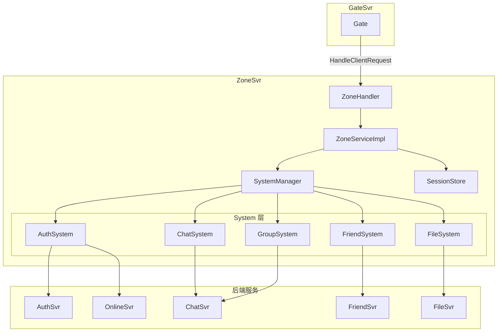
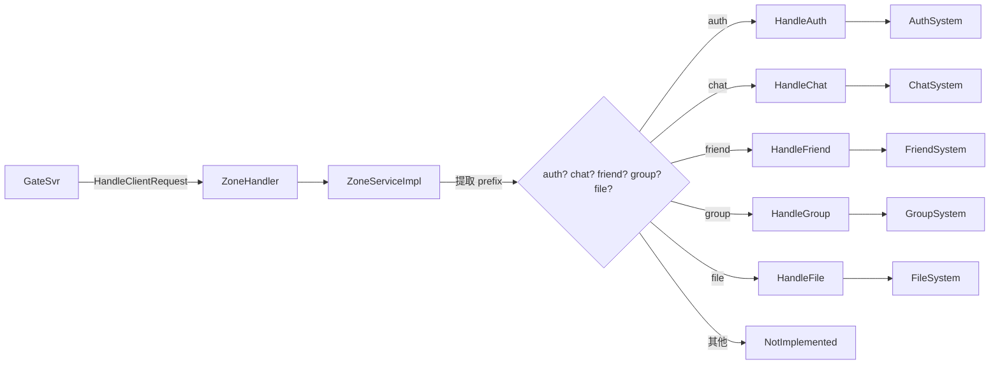

# Zone-System 模式：统一入口与 cmd 分发的路由服务设计

> 本文是 SwiftChatSystem 后端系列博客的第五篇，介绍 ZoneSvr 作为 API Gateway 的设计：SystemManager、按 cmd 分发的 HandleClientRequest、SessionStore、消息路由以及 Internal Secret 内网认证。

---

## 一、ZoneSvr 的定位与职责

GateSvr 负责「接入」， ZoneSvr 负责「调度」。客户端业务请求（如发消息、加好友）经 Gate 转发后，全部汇聚到 Zone 的**唯一入口** `HandleClientRequest`。Zone 根据 cmd 前缀（`auth.`、`chat.`、`friend.` 等）分发到对应 System，由 System 通过 gRPC 调用后端服务，完成业务逻辑。

| 职责 | 说明 |
|------|------|
| **统一入口** | 所有业务请求经 HandleClientRequest 进入，便于鉴权、限流、监控 |
| **cmd 分发** | 按前缀选择 AuthSystem、ChatSystem、FriendSystem、GroupSystem、FileSystem |
| **会话状态** | SessionStore 维护 user_id → gate_addr 映射，用于消息路由 |
| **Gate 管理** | 接收 Gate 注册与心跳，维护 Gate 节点列表 |
| **消息路由** | RouteToUser、Broadcast、PushToUser 将消息投递到正确 Gate |

可以把它理解为「调度中心」：Gate 是前台，Zone 是调度室，System 是接线员，后端 Svr 是具体科室。

---

## 二、整体架构

### 2.1 组件关系



### 2.2 两类 RPC

Zone 暴露的 gRPC 接口可分为两类：

| 类型 | 调用方 | 典型 RPC |
|------|--------|----------|
| **会话/路由** | Gate | UserOnline、UserOffline、HandleClientRequest、GateRegister、GateHeartbeat |
| **消息投递** | 后端或其他服务 | RouteMessage、Broadcast、PushToUser、GetUserStatus、KickUser |

`HandleClientRequest` 是 Gate 转发的业务请求入口；RouteMessage、PushToUser 等用于将消息推送到在线用户的连接。

---

## 三、SystemManager 与 System 层

### 3.1 System 的职责边界

各 System **只做 RPC 转发**，不实现业务逻辑。业务逻辑在后端服务（AuthSvr、ChatSvr 等）中实现。

```
ZoneServiceImpl
    │
    ├── HandleAuth   → AuthSystem  → AuthSvr + OnlineSvr
    ├── HandleChat   → ChatSystem  → ChatSvr
    ├── HandleFriend → FriendSystem → FriendSvr
    ├── HandleGroup  → GroupSystem → ChatSvr (GroupService)
    └── HandleFile   → FileSystem  → FileSvr
```

SystemManager 负责创建、初始化、关闭所有 System，并注入 SessionStore 与 ZoneConfig：

```cpp
bool SystemManager::Init(const ZoneConfig& config) {
    // 1. 创建 SessionStore（所有 System 共享）
    if (config.session_store_type == "redis")
        session_store_ = std::make_shared<RedisSessionStore>(config.redis_url);
    else
        session_store_ = std::make_shared<MemorySessionStore>();

    // 2. 创建所有 System
    auth_system_ = std::make_unique<AuthSystem>();
    chat_system_ = std::make_unique<ChatSystem>();
    friend_system_ = std::make_unique<FriendSystem>();
    group_system_ = std::make_unique<GroupSystem>();
    file_system_ = std::make_unique<FileSystem>();

    // 3. 注入 SessionStore 与配置
    for (BaseSystem* sys : {...}) {
        sys->SetSessionStore(session_store_);
        sys->SetConfig(&config);
    }

    // 4. 初始化所有 System（建立 RPC 连接）
    if (!auth_system_->Init()) return false;
    // ...
    return true;
}
```

### 3.2 BaseSystem 与 RPC 客户端

每个 System 继承 BaseSystem，持有对应后端的 RPC Client：

```cpp
// base_system.h
class BaseSystem {
public:
    virtual std::string Name() const = 0;
    virtual bool Init() = 0;
    virtual void Shutdown() = 0;
    void SetSessionStore(std::shared_ptr<SessionStore> store);
    void SetConfig(const ZoneConfig* config);
protected:
    std::shared_ptr<SessionStore> session_store_;
    const ZoneConfig* config_ = nullptr;
};
```

以 ChatSystem 为例，Init 时建立与 ChatSvr 的连接：

```cpp
bool ChatSystem::Init() {
    rpc_client_ = std::make_unique<ChatRpcClient>();
    if (!rpc_client_->Connect(config_->chat_svr_addr, !config_->standalone))
        return false;
    rpc_client_->InitStub();
    return true;
}
```

### 3.3 AuthSystem 的特殊性

Auth 相关请求需要同时调用 AuthSvr 与 OnlineSvr：

- **auth.login**：AuthSvr.VerifyCredentials → OnlineSvr.Login
- **auth.logout**：OnlineSvr.Logout
- **auth.validate_token**：OnlineSvr.ValidateToken

因此 AuthSystem 持有 AuthRpcClient 和 OnlineRpcClient，并在内部完成两段调用的串联。

---

## 四、HandleClientRequest：按 cmd 分发

### 4.1 分发流程



### 4.2 前缀表驱动

ZoneServiceImpl 使用「前缀 → 处理函数」的映射，避免长 if-else：

```cpp
const std::unordered_map<std::string, CmdHandlerFn>& GetPrefixHandlers() {
    static const std::unordered_map<std::string, CmdHandlerFn> kHandlers = {
        {"auth",   &ZoneServiceImpl::HandleAuth},
        {"chat",   &ZoneServiceImpl::HandleChat},
        {"friend", &ZoneServiceImpl::HandleFriend},
        {"group",  &ZoneServiceImpl::HandleGroup},
        {"file",   &ZoneServiceImpl::HandleFile},
    };
    return kHandlers;
}

HandleClientRequestResult HandleClientRequest(...) {
    std::string prefix = (dot != std::string::npos) ? cmd.substr(0, dot) : cmd;
    auto it = handlers.find(prefix);
    if (it != handlers.end())
        return (this->*it->second)(user_id, cmd, payload, request_id, token);
    return NotImplemented(cmd, request_id);
}
```

新增业务域时，只需在 kHandlers 中增加一项并实现对应的 `HandleXxx`。

### 4.3 Token 传递

Gate 在 `HandleClientRequestRequest` 中携带 token，Zone 原样传给各 Handle 函数，Handle 再传给 System。System 调用后端 RPC 时，通过 `RpcClientBase::CreateContext(..., token)` 将 token 注入到 gRPC metadata，供业务服务鉴权。

---

## 五、SessionStore：用户会话与 Gate 节点

### 5.1 数据结构

```cpp
struct UserSession {
    std::string user_id;
    std::string gate_id;       // 连接的网关 ID
    std::string gate_addr;     // 网关 gRPC 地址（用于 PushToGate）
    std::string device_type;
    std::string device_id;
    int64_t online_at;
    int64_t last_active_at;
};

struct GateNode {
    std::string gate_id;
    std::string address;       // gRPC 地址
    int current_connections;
    int64_t registered_at;
    int64_t last_heartbeat;
};
```

### 5.2 存储接口

```cpp
class SessionStore {
public:
    // 用户会话
    virtual bool SetOnline(const UserSession& session) = 0;
    virtual bool SetOffline(const std::string& user_id) = 0;
    virtual std::optional<UserSession> GetSession(const std::string& user_id) = 0;
    virtual std::vector<UserSession> GetSessions(const std::vector<std::string>& user_ids) = 0;

    // 网关节点
    virtual bool RegisterGate(const GateNode& node) = 0;
    virtual bool UpdateGateHeartbeat(const std::string& gate_id, int connections) = 0;
    virtual std::optional<GateNode> GetGate(const std::string& gate_id) = 0;
    // ...
};
```

### 5.3 两种实现

| 实现 | 适用场景 | 说明 |
|------|----------|------|
| **MemorySessionStore** | 单机/开发 | 内存 map，单 Zone 副本 |
| **RedisSessionStore** | 生产/多副本 | 多个 Zone Pod 共享状态，支持 TTL |

配置 `session_store_type=memory` 或 `redis` 即可切换。

---

## 六、用户上线/下线与 Gate 管理

### 6.1 用户上线

Gate 在 `auth.login` 成功后调用 Zone 的 `UserOnline`：

```cpp
bool ZoneServiceImpl::UserOnline(const std::string& user_id, const std::string& gate_id,
                                 const std::string& device_type, const std::string& device_id) {
    auto gate = store_->GetGate(gate_id);  // 校验 Gate 已注册
    if (!gate) return false;
    UserSession session;
    session.user_id = user_id;
    session.gate_id = gate_id;
    session.gate_addr = gate->address;
    session.device_type = device_type;
    session.device_id = device_id;
    session.online_at = session.last_active_at = now_ms;
    return store_->SetOnline(session);
}
```

必须先有 Gate 注册，UserOnline 才能成功；否则无法获得 `gate_addr`。

### 6.2 用户下线

用户断开连接时，Gate 调用 `UserOffline`；Zone 从 SessionStore 中移除该 user_id，后续路由时该用户将视为离线。

### 6.3 Gate 注册与心跳

```cpp
bool RegisterGate(const std::string& gate_id, const std::string& address) {
    GateNode node;
    node.gate_id = gate_id;
    node.address = address;
    node.current_connections = 0;
    node.registered_at = node.last_heartbeat = now_ms;
    return store_->RegisterGate(node);
}

bool GateHeartbeat(const std::string& gate_id, int connections) {
    return store_->UpdateGateHeartbeat(gate_id, connections);
}
```

Gate 启动时注册，之后定期心跳。Zone 可根据 `last_heartbeat` 清理僵尸 Gate。

---

## 七、消息路由：RouteToUser、Broadcast、PushToGate

### 7.1 RouteToUser

将消息投递给单个在线用户：

```cpp
RouteResult RouteToUser(const std::string& user_id, const std::string& cmd,
                        const std::string& payload) {
    auto opt = store_->GetSession(user_id);
    if (!opt) {
        result.user_online = false;
        return result;
    }
    result.user_online = true;
    result.gate_id = opt->gate_id;
    result.delivered = PushToGate(opt->gate_addr, user_id, cmd, payload);
    return result;
}
```

### 7.2 PushToGate

按 gate_addr 获取或创建 GateRpcClient，调用 Gate 的 PushMessage：

```cpp
bool PushToGate(const std::string& gate_addr, const std::string& user_id,
                const std::string& cmd, const std::string& payload) {
    auto client = GetOrCreateGateClient(gate_addr);
    if (!client) return false;
    return client->PushMessage(user_id, cmd, payload, nullptr);
}

std::shared_ptr<GateRpcClient> GetOrCreateGateClient(const std::string& gate_addr) {
    std::lock_guard<std::mutex> lock(gate_clients_mutex_);
    auto it = gate_clients_.find(gate_addr);
    if (it != gate_clients_.end() && it->second->IsConnected())
        return it->second;
    auto client = std::make_shared<GateRpcClient>();
    if (!client->Connect(gate_addr)) return nullptr;
    client->InitStub();
    gate_clients_[gate_addr] = client;
    return client;
}
```

Zone 按 gate_addr 缓存 GateRpcClient，避免重复建连。

### 7.3 BindChatPushToUser：ChatSystem 与 RouteToUser 的衔接

ChatSystem 在发送消息后需要推送在线接收方，但它不直接持有 SessionStore。Zone 通过**回调注入**将 `RouteToUser` 绑定到 ChatSystem：

```cpp
void ZoneServiceImpl::BindChatPushToUser() {
    auto* chat = manager_->GetChatSystem();
    if (!chat) return;
    chat->SetPushToUserCallback([this](const std::string& user_id,
                                       const std::string& cmd,
                                       const std::string& payload) {
        auto r = RouteToUser(user_id, cmd, payload);
        return r.delivered;
    });
}
```

ChatSystem 内部在需要推送时调用 `push_to_user_callback_`，实际执行的是 Zone 的 `RouteToUser`，从而完成「ChatSystem 发消息 → Zone 查 Session → PushToGate」的闭环。

---

## 八、Internal Secret：内网调用认证

### 8.1 为何需要

Zone 只应接受来自 Gate（或其它可信内网服务）的调用。若对外开放，恶意客户端可能直接调用 Zone 的 gRPC，绕过 Gate 的登录与鉴权。因此需要**内网认证**：只有携带正确密钥的请求才被接受。

### 8.2 实现方式

Zone 在创建 gRPC Server 时注册 `AuthMetadataProcessor`：

```cpp
// main.cpp
auto creds = grpc::InsecureServerCredentials();
if (!config.internal_secret.empty()) {
    creds->SetAuthMetadataProcessor(
        std::make_shared<InternalSecretProcessor>(config.internal_secret));
}
grpc::ServerBuilder builder;
builder.AddListeningPort(addr, creds);
builder.RegisterService(handler.get());
```

`InternalSecretProcessor` 在业务 Handler 之前执行，从 metadata 读取 `x-internal-secret` 并校验：

```cpp
grpc::Status InternalSecretProcessor::Process(const InputMetadata& auth_metadata, ...) {
    if (expected_.empty()) return grpc::Status::OK;  // 未配置则跳过
    auto it = auth_metadata.find("x-internal-secret");
    if (it == auth_metadata.end())
        return grpc::Status(grpc::StatusCode::UNAUTHENTICATED,
                            "missing or invalid x-internal-secret");
    std::string value(it->second.data(), it->second.size());
    if (value != expected_)
        return grpc::Status(grpc::StatusCode::UNAUTHENTICATED, ...);
    return grpc::Status::OK;
}
```

Gate 的 ZoneRpcClient 在每次调用 Zone 时，通过 `ClientContext::AddMetadata("x-internal-secret", secret)` 注入密钥。密钥由环境变量 `ZONESVR_INTERNAL_SECRET`、`GATESVR_ZONESVR_INTERNAL_SECRET` 注入，不写入配置文件。

---

## 九、配置与小结

### 9.1 主要配置项

| 配置项 | 默认值 | 说明 |
|--------|--------|------|
| host / port | 0.0.0.0:9092 | Zone 监听地址 |
| auth_svr_addr | localhost:9094 | AuthSvr 地址 |
| online_svr_addr | localhost:9095 | OnlineSvr 地址 |
| chat_svr_addr | localhost:9098 | ChatSvr 地址 |
| friend_svr_addr | localhost:9096 | FriendSvr 地址 |
| file_svr_addr | localhost:9100 | FileSvr 地址 |
| session_store_type | memory | memory / redis |
| redis_url | redis://localhost:6379 | Redis 地址（session_store_type=redis 时） |
| internal_secret | 空 | 内网密钥，空表示不校验 |

### 9.2 小结

ZoneSvr 的核心设计可归纳为：

1. **SystemManager**：统一管理 5 个 System 的生命周期，注入 SessionStore 与配置
2. **HandleClientRequest**：按 cmd 前缀表驱动分发，Token 随调用链传递到后端
3. **System 仅做 RPC 转发**：业务逻辑在后端服务，System 负责解析 payload、调 RPC、组装 result
4. **SessionStore**：用户会话与 Gate 节点，支持 Memory / Redis，用于消息路由
5. **RouteToUser / PushToGate**：查 Session 得 gate_addr，按地址缓存 GateRpcClient 并推送
6. **BindChatPushToUser**：通过回调将 Zone 的 RouteToUser 注入 ChatSystem，完成消息推送闭环
7. **Internal Secret**：内网密钥校验，防止外部直接调用 Zone

下一篇文章将介绍 AuthSvr 的身份与用户资料管理，敬请期待。
