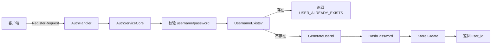
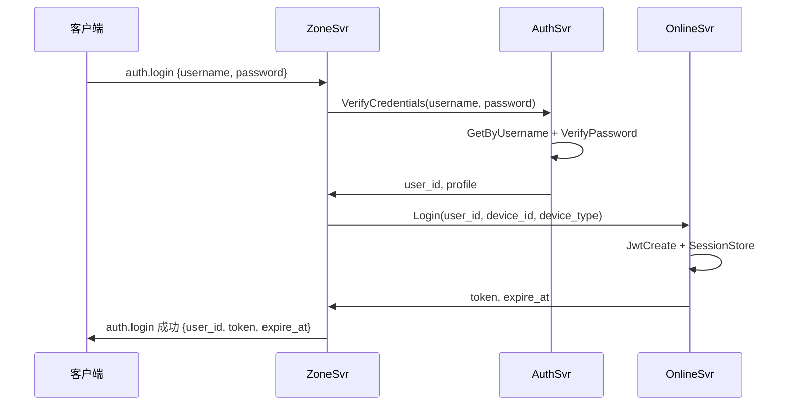

# 认证服务设计：注册、密码校验与用户资料管理

> 本文是 SwiftChatSystem 后端系列博客的第六篇，介绍 AuthSvr 的职责边界、UserStore 接口与 RocksDB 实现、Key 设计、密码哈希策略以及 JWT 鉴权在业务接口中的应用。

---

## 一、AuthSvr 的职责边界

在 SwiftChatSystem 中，认证能力被拆成两个服务：

| 服务 | 职责 | 是否管理登录会话 |
|------|------|------------------|
| **AuthSvr** | 身份与资料：注册、校验用户名密码、GetProfile、UpdateProfile | 否 |
| **OnlineSvr** | 登录会话：Login、Logout、ValidateToken、JWT 签发 | 是 |

**设计原因**：身份（「你是谁」）与会话（「你是否已登录」）关注点不同。AuthSvr 负责用户数据与凭证校验，OnlineSvr 负责 Token 与登录态。这样各自可以独立演进和扩容，客户端登录时先调 AuthSvr.VerifyCredentials，再调 OnlineSvr.Login 获取 Token。

---

## 二、接口概览

### 2.1 四个 RPC

```protobuf
service AuthService {
    rpc Register(RegisterRequest) returns (RegisterResponse);
    rpc VerifyCredentials(VerifyCredentialsRequest) returns (VerifyCredentialsResponse);
    rpc GetProfile(GetProfileRequest) returns (UserProfile);
    rpc UpdateProfile(UpdateProfileRequest) returns (swift.common.CommonResponse);
}
```

### 2.2 鉴权要求

| 接口 | 是否需要 Token | 说明 |
|------|----------------|------|
| Register | 否 | 注册前无登录态 |
| VerifyCredentials | 否 | 登录前校验账号密码 |
| GetProfile | 是 | 业务接口，需鉴权 |
| UpdateProfile | 是 | 业务接口，需鉴权 |

Register、VerifyCredentials 为「登录前」接口，不要求 JWT。GetProfile、UpdateProfile 涉及当前用户资料，必须在 gRPC metadata 中携带 JWT，服务端以 Token 解析出的 user_id 为准。

---

## 三、UserStore 接口与 RocksDB 实现

### 3.1 数据结构

```cpp
struct UserData {
    std::string user_id;
    std::string username;
    std::string password_hash;   // 仅存哈希，不存明文
    std::string nickname;
    std::string avatar_url;
    std::string signature;
    int gender = 0;
    int64_t created_at = 0;
    int64_t updated_at = 0;
};
```

对外暴露的 `AuthProfile` 不含 `password_hash`，用于 proto 的 UserProfile 及 API 返回。

### 3.2 Store 接口

```cpp
class UserStore {
public:
    virtual bool Create(const UserData& user) = 0;
    virtual std::optional<UserData> GetById(const std::string& user_id) = 0;
    virtual std::optional<UserData> GetByUsername(const std::string& username) = 0;
    virtual bool Update(const UserData& user) = 0;
    virtual bool UsernameExists(const std::string& username) = 0;
};
```

当前仅有 RocksDB 实现；若后续接入 MySQL，可新增 `MySQLUserStore`，业务层无需改动。

---

## 四、Key 设计与 RocksDB 读写

### 4.1 Key 约定

```
user:{user_id}       → UserData (JSON 序列化)
username:{username}  → user_id (字符串)
```

- `user:{id}`：主键，用于按 user_id 查完整用户
- `username:{name}`：索引，用于登录时按用户名查 user_id，再查 `user:{id}`

### 4.2 创建用户：WriteBatch 原子写入

注册时需要同时写入两条记录，保证一致性：

```cpp
bool RocksDBUserStore::Create(const UserData& user) {
    if (UsernameExists(user.username))
        return false;

    rocksdb::WriteBatch batch;
    batch.Put(KEY_PREFIX_USER + user.user_id, SerializeUser(user));
    batch.Put(KEY_PREFIX_USERNAME + user.username, user.user_id);

    rocksdb::WriteOptions write_opts;
    write_opts.sync = true;
    return impl_->db->Write(write_opts, &batch).ok();
}
```

使用 `WriteBatch` 保证两条 Put 要么都成功，要么都失败。

### 4.3 按用户名查询：两次读取

登录时只有 username 和 password，需要先查 `username:{name}` 拿到 user_id，再查 `user:{id}`：

```cpp
std::optional<UserData> RocksDBUserStore::GetByUsername(const std::string& username) {
    std::string user_id;
    if (!impl_->db->Get(rocksdb::ReadOptions(),
                        KEY_PREFIX_USERNAME + username, &user_id).ok())
        return std::nullopt;
    return GetById(user_id);
}
```

### 4.4 更新用户与索引

若 `Update` 时修改了 username，需要同步更新索引：

```cpp
if (existing->username != user.username) {
    if (UsernameExists(user.username)) return false;
    batch.Delete(KEY_PREFIX_USERNAME + existing->username);
    batch.Put(KEY_PREFIX_USERNAME + user.username, user.user_id);
}
batch.Put(KEY_PREFIX_USER + user.user_id, SerializeUser(user));
```

---

## 五、注册流程

### 5.1 流程示意



### 5.2 校验规则

```cpp
// 用户名：字母、数字、下划线，3-32 位
bool ValidateUsername(const std::string& username) {
    if (username.size() < 3 || username.size() > 32) return false;
    for (char c : username) {
        if (!std::isalnum(static_cast<unsigned char>(c)) && c != '_')
            return false;
    }
    return true;
}

// 密码：至少 8 位
bool ValidatePassword(const std::string& password) {
    return password.size() >= 8;
}
```

### 5.3 密码哈希

使用「密码 + 盐」的 SHA256 哈希，盐固定（生产环境建议改为随机盐或 bcrypt）：

```cpp
constexpr const char* kPasswordSalt = "swift_salt_2026";

std::string HashPassword(const std::string& password) {
    return swift::utils::SHA256(password + kPasswordSalt);
}
```

### 5.4 user_id 生成

```cpp
std::string GenerateUserId() {
    return swift::utils::GenerateShortId("u_", 12);  // 如 "u_7kX9mPqR3sT1"
}
```

---

## 六、VerifyCredentials 与登录链路

### 6.1 登录流程（两段调用）

客户端完整登录流程为：

1. **AuthSvr.VerifyCredentials**：校验 username、password，返回 user_id 和 profile
2. **OnlineSvr.Login**：传入 user_id 和设备信息，返回 JWT 和过期时间



### 6.2 VerifyCredentials 实现

```cpp
VerifyCredentialsResult VerifyCredentials(const std::string& username,
                                          const std::string& password) {
    auto user = store_->GetByUsername(username);
    if (!user) {
        result.error_code = swift::ErrorCode::USER_NOT_FOUND;
        return result;
    }
    if (!VerifyPassword(password, user->password_hash)) {
        result.error_code = swift::ErrorCode::PASSWORD_WRONG;
        return result;
    }
    result.success = true;
    result.user_id = user->user_id;
    result.profile = ToProfile(*user);
    return result;
}
```

VerifyCredentials 只做「身份校验 + 返回资料」，不创建会话、不签发 Token，会话和 Token 由 OnlineSvr 负责。

---

## 七、GetProfile / UpdateProfile 与 JWT 鉴权

### 7.1 为何不信任请求体中的 user_id

若直接使用 `GetProfileRequest.user_id()`，恶意客户端可伪造他人 user_id 查询资料；`UpdateProfile` 同理，存在越权风险。正确做法是**以 gRPC metadata 中的 JWT 解析出的 user_id 为准**。

### 7.2 Handler 中的用法

```cpp
::grpc::Status AuthHandler::GetProfile(::grpc::ServerContext* context,
                                        const GetProfileRequest* request,
                                        UserProfile* response) {
    std::string uid = swift::GetAuthenticatedUserId(context, jwt_secret_);
    if (uid.empty()) {
        return ::grpc::Status(::grpc::StatusCode::UNAUTHENTICATED,
                             "token invalid or missing");
    }
    // 忽略 request->user_id()，以 uid 为准
    auto profile = service_->GetProfile(uid);
    if (!profile)
        return ::grpc::Status(::grpc::StatusCode::NOT_FOUND, "user not found");
    // 填充 response ...
    return ::grpc::Status::OK;
}

::grpc::Status AuthHandler::UpdateProfile(::grpc::ServerContext* context,
                                          const UpdateProfileRequest* request,
                                          CommonResponse* response) {
    std::string uid = swift::GetAuthenticatedUserId(context, jwt_secret_);
    if (uid.empty()) {
        response->set_code(swift::ErrorCodeToInt(swift::ErrorCode::TOKEN_INVALID));
        response->set_message("token invalid or missing");
        return ::grpc::Status::OK;
    }
    auto result = service_->UpdateProfile(uid,
                                          request->nickname(),
                                          request->avatar_url(),
                                          request->signature());
    // ...
}
```

`GetAuthenticatedUserId` 从 metadata 中取 Token 并校验，成功则返回 user_id，失败返回空串。这样 GetProfile 始终查的是「当前登录用户」的资料，UpdateProfile 也只更新当前用户，避免越权。

### 7.3 UpdateProfile 的「空字符串不更新」

UpdateProfile 采用「空字符串表示不更新该字段」的策略：

```cpp
if (!nickname.empty()) user->nickname = nickname;
if (!avatar_url.empty()) user->avatar_url = avatar_url;
if (!signature.empty()) user->signature = signature;
```

客户端若只想改 nickname，可只填 nickname，其余字段留空。

---

## 八、三层结构回顾

AuthSvr 遵循 Handler → Service → Store 的分层：

| 层级 | 职责 |
|------|------|
| **AuthHandler** | 对接 gRPC，解析请求、组装响应；GetProfile/UpdateProfile 调用 GetAuthenticatedUserId |
| **AuthServiceCore** | 业务逻辑：校验、哈希、调用 Store |
| **UserStore / RocksDBUserStore** | 持久化，Key 设计，序列化 |

main 中的组装：

```cpp
auto store = std::make_shared<swift::auth::RocksDBUserStore>(config.rocksdb_path);
auto service_core = std::make_shared<swift::auth::AuthServiceCore>(store);
swift::auth::AuthHandler handler(service_core, config.jwt_secret);
```

`jwt_secret` 需与 OnlineSvr 一致，才能正确校验其签发的 Token。

---

## 九、小结

AuthSvr 的核心设计可归纳为：

1. **职责边界**：只负责身份与资料，不负责登录会话和 Token 签发
2. **UserStore 接口**：Create、GetById、GetByUsername、Update、UsernameExists
3. **Key 设计**：`user:{id}` 存完整用户，`username:{name}` 存 user_id 索引
4. **WriteBatch**：注册时原子写入两条记录，更新 username 时同步维护索引
5. **密码**：SHA256(password + salt)，不存明文
6. **登录流程**：VerifyCredentials 校验身份 → OnlineSvr.Login 签发 Token
7. **JWT 鉴权**：GetProfile、UpdateProfile 用 GetAuthenticatedUserId 取 user_id，不信任请求体

下一篇文章将介绍 OnlineSvr 的登录会话管理与 JWT 签发，敬请期待。
