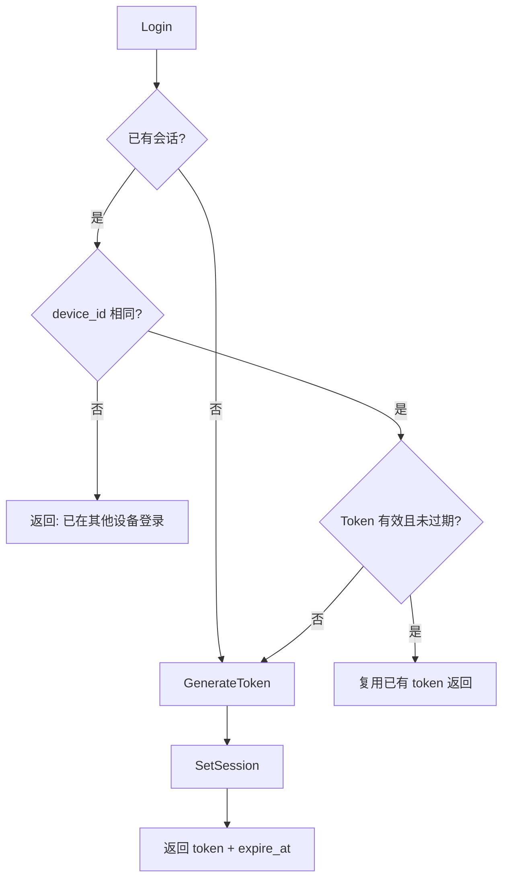
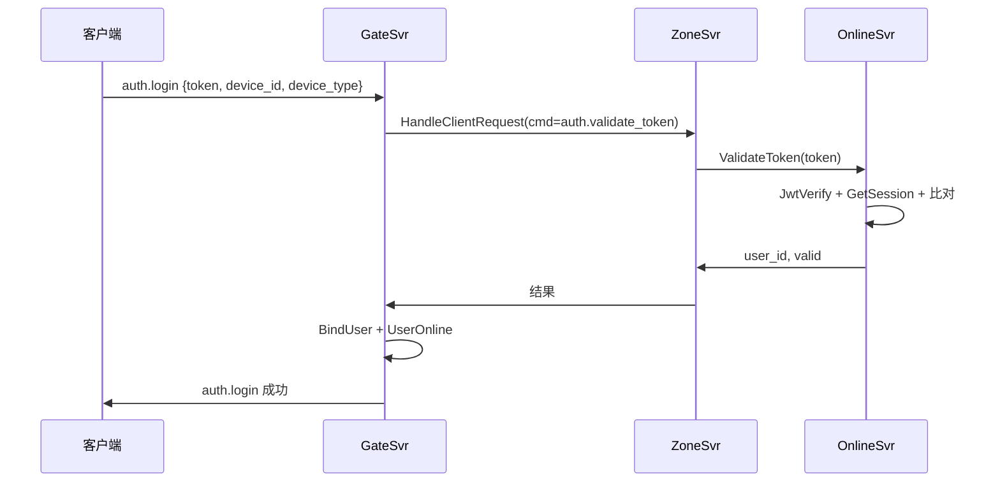
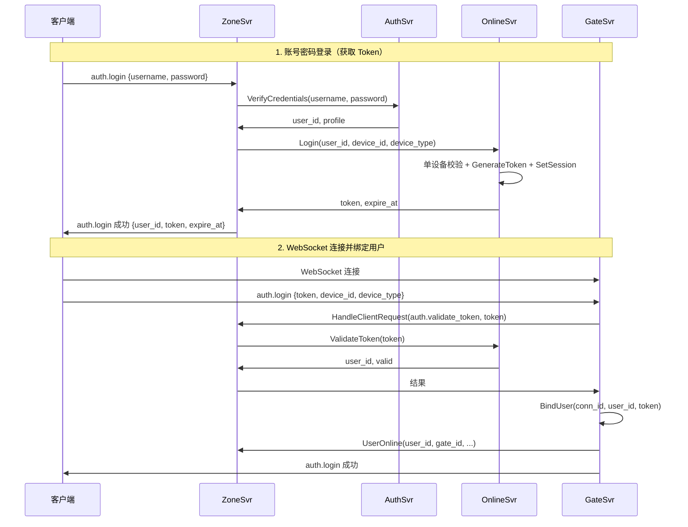

# 登录态管理：JWT 签发、会话存储与单设备策略

> 本文是 SwiftChatSystem 后端系列博客的第七篇，介绍 OnlineSvr 的职责、SessionStore、Login/Logout/ValidateToken 实现、单设备策略，以及 ValidateToken 与 JwtVerify 的区别和两种鉴权场景。

---

## 一、OnlineSvr 的职责边界

AuthSvr 负责「身份」（注册、校验账号密码、用户资料），OnlineSvr 负责「登录态」：

| 能力 | AuthSvr | OnlineSvr |
|------|---------|-----------|
| 注册 | ✓ | - |
| 校验用户名密码 | ✓ | - |
| 获取/更新资料 | ✓ | - |
| 签发 Token | - | ✓ |
| 登录/登出 | - | ✓ |
| 校验 Token 是否仍为有效会话 | - | ✓ |

**Token 的唯一签发方**是 OnlineSvr。客户端先通过 AuthSvr.VerifyCredentials 校验账号密码，再通过 OnlineSvr.Login 获取 JWT；后续 WebSocket 登录与业务请求都携带该 Token。

---

## 二、接口概览

### 2.1 三个 RPC

```protobuf
service OnlineService {
    rpc Login(LoginRequest) returns (LoginResponse);
    rpc Logout(LogoutRequest) returns (swift.common.CommonResponse);
    rpc ValidateToken(TokenRequest) returns (TokenResponse);
}
```

| 接口 | 调用方 | 说明 |
|------|--------|------|
| Login | Zone（auth.login 中的 AuthSystem） | 建立会话，签发 Token |
| Logout | Zone（auth.logout） | 删除会话 |
| ValidateToken | Zone（auth.login 时 Gate 转发） | 校验 Token 是否为有效会话，用于 WebSocket 连接绑定 |

Login 的入参为 user_id、device_id、device_type；user_id 来自 AuthSvr.VerifyCredentials，表示已在 AuthSvr 侧完成身份校验。

---

## 三、SessionStore 与 RocksDB 实现

### 3.1 会话数据结构

```cpp
struct SessionData {
    std::string user_id;
    std::string device_id;       // 设备标识，单设备策略用
    std::string token;           // 当前会话的 JWT
    int64_t login_time = 0;
    int64_t expire_at = 0;       // Token 过期时间戳
};
```

每个 user_id 对应一条会话；单设备策略下，同一 user_id 只允许一个 device_id 登录。

### 3.2 Store 接口

```cpp
class SessionStore {
public:
    virtual bool SetSession(const SessionData& session) = 0;
    virtual std::optional<SessionData> GetSession(const std::string& user_id) = 0;
    virtual bool RemoveSession(const std::string& user_id) = 0;
};
```

### 3.3 Key 设计

```
session:{user_id}  → SessionData (JSON)
```

RocksDB 实现中，key 为 `session:` + user_id，value 为 JSON 序列化的 SessionData。

---

## 四、Login 流程与单设备策略

### 4.1 流程示意



### 4.2 单设备策略逻辑

```cpp
LoginResult Login(const std::string& user_id,
                  const std::string& device_id,
                  const std::string& device_type) {
    std::string normalized_device = NormalizeDeviceId(device_id);
    auto existing_session = store_->GetSession(user_id);

    if (existing_session.has_value()) {
        if (existing_session->device_id != normalized_device) {
            result.success = false;
            result.error = "User already logged in on another device";
            return result;
        }
        // 同设备：若 token 仍有效，直接复用
        swift::JwtPayload payload = swift::JwtVerify(existing_session->token, jwt_secret_);
        if (payload.valid && existing_session->expire_at > now_ms) {
            result.success = true;
            result.token = existing_session->token;
            result.expire_at = existing_session->expire_at;
            return result;
        }
    }

    // 新会话或旧会话已失效：生成新 token 并写入 SessionStore
    auto [token, expire_at] = GenerateToken(user_id);
    SessionData session{...};
    store_->SetSession(session);
    result.success = true;
    result.token = token;
    result.expire_at = expire_at;
    return result;
}
```

**要点**：

- 已有会话且 device_id 不同 → 拒绝登录，返回「已在其他设备登录」
- 已有会话且 device_id 相同，且 token 未过期 → 复用已有 token
- 无会话或 token 已过期 → 生成新 token 并覆盖 SessionStore

### 4.3 Token 生成与过期

```cpp
std::pair<std::string, int64_t> GenerateToken(const std::string& user_id) {
    int64_t now_ms = swift::utils::GetTimestampMs();
    int expire_hours = static_cast<int>(kTokenExpireDays * 24);  // 7 天
    std::string token = swift::JwtCreate(user_id, jwt_secret_, expire_hours);
    int64_t expire_at = now_ms + kTokenExpireDays * kMsPerDay;
    return {token, expire_at};
}
```

JWT 的 exp 与 SessionData 的 expire_at 对齐，均为 7 天（可配置）。

---

## 五、Logout 与会话清理

```cpp
LogoutResult Logout(const std::string& user_id, const std::string& token) {
    store_->RemoveSession(user_id);
    result.success = true;
    return result;
}
```

Logout 直接删除该 user_id 的会话。此后，同一 token 再用于 auth.login（WebSocket 登录）时，ValidateToken 会查不到会话，返回 invalid。

---

## 六、ValidateToken 与 JwtVerify 的区别

### 6.1 两种校验方式

| 项目 | JwtVerify（公共库） | OnlineSvr.ValidateToken |
|------|---------------------|--------------------------|
| **作用** | 校验 JWT 签名、exp、iss、sub | 在 JwtVerify 通过后，再查 SessionStore 判断是否为当前有效会话 |
| **是否查库** | 否，纯本地计算 | 是，查 SessionStore |
| **登出后** | 在 exp 前，签名仍有效，JwtVerify 仍返回 valid | 登出后 RemoveSession，查不到会话或 token 不一致，返回 invalid |
| **使用位置** | 业务服务的 GetAuthenticatedUserId | WebSocket auth.login 时的连接身份校验 |

### 6.2 ValidateToken 实现

```cpp
TokenResult ValidateToken(const std::string& token) {
    swift::JwtPayload payload = swift::JwtVerify(token, jwt_secret_);
    if (!payload.valid) return result;

    auto session = store_->GetSession(payload.user_id);
    if (!session) return result;

    int64_t now_ms = swift::utils::GetTimestampMs();
    if (session->token != token || session->expire_at <= now_ms) {
        store_->RemoveSession(payload.user_id);  // 会话已失效，清理
        return result;
    }

    result.valid = true;
    result.user_id = payload.user_id;
    return result;
}
```

校验顺序：① JwtVerify 验签与过期；② 查 SessionStore；③ 校验 session.token 与当前 token 一致，且 session.expire_at > now。任一不满足则返回 invalid。

### 6.3 为何需要「查库」

JwtVerify 只看 JWT 本身，登出后 Token 在 exp 前仍可验签通过。ValidateToken 通过 SessionStore 判断该 token 是否仍是「当前有效会话」：登出后会话被删，ValidateToken 失败，从而在 WebSocket 登录场景实现「登出即失效」。

---

## 七、两种鉴权场景

### 7.1 场景 A：WebSocket 登录（ValidateToken）

客户端连接 Gate 的 WebSocket 后，发送 `auth.login`，payload 带 token、device_id、device_type。Gate 通过 Zone 调用 `auth.validate_token`，最终到 OnlineSvr.ValidateToken：



只有 ValidateToken 返回 valid，Gate 才会 BindUser 并 UserOnline，建立「连接 ↔ 用户」的绑定。

### 7.2 场景 B：业务接口鉴权（JwtVerify）

业务请求（如 friend.add、chat.send_message）由 Gate 从 Connection 中取出 token，经 Zone 注入到调用 FriendSvr、ChatSvr 等的 gRPC metadata。业务服务通过 `GetAuthenticatedUserId(context, jwt_secret)` 获取 user_id，内部**只调用 JwtVerify**，不查 OnlineSvr：

```cpp
// grpc_auth.cpp
std::string GetAuthenticatedUserId(..., const std::string& jwt_secret) {
    std::string token = GetTokenFromContext(context);
    if (token.empty()) return "";
    JwtPayload payload = JwtVerify(token, jwt_secret);
    if (!payload.valid) return "";
    return payload.user_id;
}
```

业务侧不做 RPC，不查库，仅做本地验签，性能更好。

### 7.3 登出后的行为

- **auth.login（WebSocket 登录）**：走 ValidateToken，登出后会话已删，会失败。
- **业务接口**：走 JwtVerify，登出后、exp 前，Token 仍会被接受。

因此当前设计是「登出后，WebSocket 重连会失败；但在 exp 前，用同一 Token 调业务接口仍会通过」。若需「登出即处处失效」，需在业务路径增加对 ValidateToken 的调用或引入 token 黑名单，会带来额外 RPC 与存储成本；本项目采用折中方案。

---

## 八、完整登录链路回顾

从客户端发起登录到建立 WebSocket 绑定，完整流程如下：



第一步的 auth.login 使用 username+password，由 Zone 的 AuthSystem 串联 AuthSvr.VerifyCredentials 与 OnlineSvr.Login；第二步的 auth.login 使用 token，用于 WebSocket 连接时的身份绑定。

---

## 九、配置与小结

### 9.1 主要配置项

| 配置项 | 默认值 | 说明 |
|--------|--------|------|
| host / port | 0.0.0.0:9095 | 监听地址 |
| store_type | rocksdb | 会话存储类型 |
| rocksdb_path | /data/online | RocksDB 路径 |
| jwt_secret | swift_online_secret_2026 | JWT 签发与校验密钥，需与 AuthSvr 等一致 |

### 9.2 小结

OnlineSvr 的核心设计可归纳为：

1. **职责**：Login、Logout、ValidateToken，Token 的唯一签发方
2. **SessionStore**：`session:{user_id}` 存 SessionData，支持 Memory/RocksDB
3. **单设备策略**：同 user_id 仅允许同一 device_id 登录，否则返回「已在其他设备登录」
4. **Token 生命周期**：JwtCreate 签发，SetSession 持久化，expire_at 与 JWT exp 对齐
5. **ValidateToken vs JwtVerify**：ValidateToken 在 JwtVerify 基础上查 SessionStore，用于 WebSocket 登录；JwtVerify 用于业务接口，仅本地验签
6. **两种鉴权场景**：auth.login 用 ValidateToken（查库）；业务接口用 GetAuthenticatedUserId → JwtVerify（不查库）

下一篇文章将介绍 FriendSvr 的好友关系、分组与黑名单设计，敬请期待。
