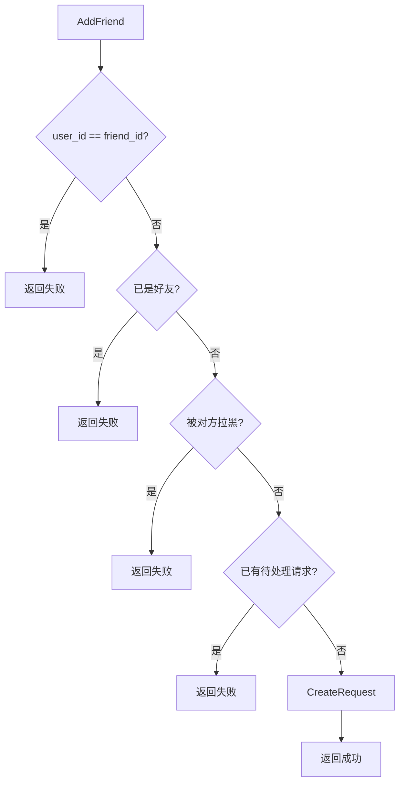

# 好友系统实现：好友关系、分组与黑名单的 gRPC 设计

> 本文是 SwiftChatSystem 后端系列博客的第八篇，介绍 FriendSvr 的职责、FriendStore 与 RocksDB 实现、好友申请/同意/拒绝/删除流程、好友分组、黑名单逻辑，以及 JWT 鉴权与 user_id 校验。

---

## 一、FriendSvr 的职责边界

在 SwiftChatSystem 中，FriendSvr 负责所有「社交关系」相关能力：

| 能力 | 说明 |
|------|------|
| 好友申请 | 发送好友请求（不直接加好友，需对方处理） |
| 好友请求处理 | 同意/拒绝，同意后加为好友并放入指定分组 |
| 好友关系 | 添加、删除（双向）、获取列表、备注、分组移动 |
| 好友分组 | 创建、获取、删除（分组内好友移至默认分组），默认分组不可删 |
| 黑名单 | 拉黑、取消拉黑、获取黑名单、是否被拉黑 |

与 AuthSvr 的关系：FriendSvr 返回的 `FriendInfo` 中需要携带 `UserProfile`（昵称、头像等），通常由 Zone 或客户端在获取好友列表后，再调用 AuthSvr.GetProfile 补全；当前实现中 profile 可由上层填充。

---

## 二、接口概览

### 2.1 RPC 列表

```protobuf
service FriendService {
    rpc AddFriend(AddFriendRequest) returns (swift.common.CommonResponse);
    rpc HandleFriendRequest(HandleFriendReq) returns (swift.common.CommonResponse);
    rpc RemoveFriend(RemoveFriendRequest) returns (swift.common.CommonResponse);
    rpc GetFriends(GetFriendsRequest) returns (FriendListResponse);
    
    rpc BlockUser(BlockUserRequest) returns (swift.common.CommonResponse);
    rpc UnblockUser(UnblockUserRequest) returns (swift.common.CommonResponse);
    rpc GetBlockList(GetBlockListRequest) returns (BlockListResponse);
    
    rpc CreateFriendGroup(CreateFriendGroupRequest) returns (swift.common.CommonResponse);
    rpc GetFriendGroups(GetFriendGroupsRequest) returns (FriendGroupListResponse);
    rpc MoveFriend(MoveFriendRequest) returns (swift.common.CommonResponse);
    rpc DeleteFriendGroup(DeleteFriendGroupRequest) returns (swift.common.CommonResponse);
    
    rpc SetRemark(SetRemarkRequest) returns (swift.common.CommonResponse);
    rpc GetFriendRequests(GetFriendRequestsRequest) returns (FriendRequestListResponse);
}
```

### 2.2 鉴权要求

所有接口均需在 gRPC metadata 中携带 JWT。Handler 通过 `GetAuthenticatedUserId(context, jwt_secret)` 获取当前用户，**不信任请求体中的 user_id**，以 Token 解析结果为准，防止越权（例如用 A 的 token 操作 B 的好友列表）。

---

## 三、FriendStore 与 RocksDB Key 设计

### 3.1 Store 接口

```cpp
class FriendStore {
    // 好友关系
    virtual bool AddFriend(const FriendData& data) = 0;
    virtual bool RemoveFriend(const std::string& user_id, const std::string& friend_id) = 0;
    virtual std::vector<FriendData> GetFriends(const std::string& user_id,
                                                const std::string& group_id = "") = 0;
    virtual bool IsFriend(const std::string& user_id, const std::string& friend_id) = 0;
    virtual bool UpdateRemark(...) = 0;
    virtual bool MoveFriend(...) = 0;

    // 好友请求
    virtual bool CreateRequest(const FriendRequestData& req) = 0;
    virtual std::optional<FriendRequestData> GetRequest(const std::string& request_id) = 0;
    virtual bool UpdateRequestStatus(const std::string& request_id, int status) = 0;
    virtual std::vector<FriendRequestData> GetReceivedRequests(const std::string& user_id) = 0;
    virtual std::vector<FriendRequestData> GetSentRequests(const std::string& user_id) = 0;

    // 分组
    virtual bool CreateGroup(const FriendGroupData& group) = 0;
    virtual std::vector<FriendGroupData> GetGroups(const std::string& user_id) = 0;
    virtual bool DeleteGroup(const std::string& user_id, const std::string& group_id) = 0;

    // 黑名单
    virtual bool Block(const std::string& user_id, const std::string& target_id) = 0;
    virtual bool Unblock(const std::string& user_id, const std::string& target_id) = 0;
    virtual bool IsBlocked(const std::string& user_id, const std::string& target_id) = 0;
    virtual std::vector<std::string> GetBlockList(const std::string& user_id) = 0;
};
```

### 3.2 Key 约定

| Key 模式 | 示例 | Value | 说明 |
|----------|------|-------|------|
| `friend:{user_id}:{friend_id}` | `friend:u_1:u_2` | FriendData JSON | 好友关系，A→B 与 B→A 各存一条 |
| `friend_req:{request_id}` | `friend_req:req_xxx` | FriendRequestData JSON | 好友请求 |
| `friend_req_to:{to_user_id}:{req_id}` | `friend_req_to:u_2:req_xxx` | "" | 收到的请求索引 |
| `friend_req_from:{from_user_id}:{req_id}` | `friend_req_from:u_1:req_xxx` | "" | 发出的请求索引 |
| `friend_group:{user_id}:{group_id}` | `friend_group:u_1:default` | FriendGroupData JSON | 好友分组 |
| `block:{user_id}:{target_id}` | `block:u_1:u_3` | "1" | 黑名单 |

好友关系为**双向存储**：A 加 B 为好友时，需写入 `friend:A:B` 与 `friend:B:A` 两条记录，保证双方都能通过前缀 `friend:{user_id}:` 迭代自己的好友列表。

---

## 四、好友申请与处理流程

### 4.1 申请流程示意



### 4.2 AddFriend 业务逻辑

```cpp
bool FriendService::AddFriend(const std::string& user_id, const std::string& friend_id,
                              const std::string& remark) {
    if (user_id == friend_id) return false;           // 不能加自己
    if (store_->IsFriend(user_id, friend_id)) return false;  // 已是好友
    if (store_->IsBlocked(friend_id, user_id)) return false; // 被对方拉黑，无法发请求

    auto received = store_->GetReceivedRequests(friend_id);
    for (const auto& r : received) {
        if (r.from_user_id == user_id && r.status == 0)
            return false;  // 已有待处理请求
    }

    FriendRequestData req;
    req.request_id = swift::utils::GenerateShortId("req_", 12);
    req.from_user_id = user_id;
    req.to_user_id = friend_id;
    req.remark = remark;
    req.status = 0;  // 待处理
    req.created_at = swift::utils::GetTimestampMs();
    return store_->CreateRequest(req);
}
```

**要点**：同一对用户（from→to）只保留一条 status=0 的待处理请求，避免重复申请骚扰。

### 4.3 HandleRequest：同意/拒绝

```cpp
bool FriendService::HandleRequest(const std::string& user_id, const std::string& request_id,
                                  bool accept, const std::string& group_id) {
    auto req = store_->GetRequest(request_id);
    if (!req) return false;
    if (req->to_user_id != user_id) return false;  // 只有接收方可处理
    if (req->status != 0) return false;            // 已处理过

    if (accept) {
        std::string target_group = group_id.empty() ? kDefaultFriendGroupId : group_id;
        EnsureDefaultGroup(user_id);

        FriendData data;
        data.user_id = user_id;           // 接收方
        data.friend_id = req->from_user_id;  // 发送方
        data.remark = "";
        data.group_id = target_group;
        data.added_at = swift::utils::GetTimestampMs();
        store_->AddFriend(data);
        return store_->UpdateRequestStatus(request_id, 1);  // 已接受
    } else {
        return store_->UpdateRequestStatus(request_id, 2);  // 已拒绝
    }
}
```

接收方同意后，在**接收方**的好友列表中添加上一方，并放入指定分组；Store 的 AddFriend 会同时写入双向关系。

---

## 五、好友关系：双向存储与删除

### 5.1 AddFriend（Store 层）

```cpp
bool RocksDBFriendStore::AddFriend(const FriendData& data) {
    if (IsFriend(data.user_id, data.friend_id)) return false;

    FriendData reverse;
    reverse.user_id = data.friend_id;
    reverse.friend_id = data.user_id;
    reverse.remark = "";
    reverse.group_id = kDefaultFriendGroupId;
    reverse.added_at = data.added_at;

    rocksdb::WriteBatch batch;
    batch.Put(KeyFriend(data.user_id, data.friend_id), SerializeFriend(data));
    batch.Put(KeyFriend(reverse.user_id, reverse.friend_id), SerializeFriend(reverse));

    rocksdb::WriteOptions wo;
    wo.sync = true;
    return impl_->db->Write(wo, &batch).ok();
}
```

使用 WriteBatch 保证 A→B 与 B→A 原子写入。

### 5.2 RemoveFriend（Store 层）

```cpp
bool RocksDBFriendStore::RemoveFriend(const std::string& user_id,
                                      const std::string& friend_id) {
    rocksdb::WriteBatch batch;
    batch.Delete(KeyFriend(user_id, friend_id));
    batch.Delete(KeyFriend(friend_id, user_id));
    return impl_->db->Write(wo, &batch).ok();
}
```

删除好友时**双向删除**，双方列表都会移除对方。

---

## 六、好友分组

### 6.1 默认分组

- **group_id**：`"default"`，常量 `kDefaultFriendGroupId`
- **显示名称**：`"我的好友"`，常量 `kDefaultFriendGroupName`
- **不可删除**：`DeleteFriendGroup` 会拒绝删除 default

新用户首次获取分组列表或接受好友时，会调用 `EnsureDefaultGroup(user_id)` 懒创建默认分组。

### 6.2 创建分组

```cpp
bool FriendService::CreateFriendGroup(const std::string& user_id,
                                      const std::string& group_name,
                                      std::string* out_group_id) {
    std::string group_id = swift::utils::GenerateShortId("g_", 8);
    FriendGroupData g;
    g.group_id = group_id;
    g.user_id = user_id;
    g.group_name = group_name;
    g.sort_order = 0;
    return store_->CreateGroup(g);
}
```

### 6.3 删除分组

删除分组时，该分组内所有好友的 `group_id` 会更新为 `default`，然后删除分组记录。使用 WriteBatch 保证原子性：

```cpp
bool RocksDBFriendStore::DeleteGroup(const std::string& user_id,
                                     const std::string& group_id) {
    std::vector<FriendData> friends = GetFriends(user_id, group_id);
    rocksdb::WriteBatch batch;
    batch.Delete(KeyFriendGroup(user_id, group_id));
    for (const auto& f : friends) {
        FriendData updated = f;
        updated.group_id = kDefaultFriendGroupId;
        batch.Put(KeyFriend(user_id, f.friend_id), SerializeFriend(updated));
    }
    return impl_->db->Write(wo, &batch).ok();
}
```

---

## 七、黑名单逻辑

### 7.1 存储

黑名单为单向关系：`block:{user_id}:{target_id}` 表示 user_id 拉黑了 target_id。

### 7.2 与好友申请的联动

在 `AddFriend` 中会检查 `IsBlocked(friend_id, user_id)`：若**对方**拉黑了**自己**，则无法发送好友请求。拉黑是单向的，A 拉黑 B 后，B 不能向 A 发请求，但 A 仍可主动向 B 发请求（若业务需禁止，可在 Service 层增加 `IsBlocked(user_id, friend_id)` 校验）。

### 7.3 与聊天的联动

ChatSvr 在发送私聊消息时，可调用 FriendSvr 或本地缓存判断 `IsBlocked(receiver_id, sender_id)`：若接收方拉黑了发送方，则拒绝消息投递。当前实现中该联动可由 Zone 或 ChatSvr 在业务层完成，FriendSvr 仅提供 `IsBlocked` 能力。

---

## 八、JWT 鉴权与 user_id 校验

### 8.1 Handler 中的 RequireAuth

```cpp
inline std::string RequireAuth(::grpc::ServerContext* context,
                              const std::string& jwt_secret,
                              ::swift::common::CommonResponse* response) {
    std::string uid = swift::GetAuthenticatedUserId(context, jwt_secret);
    if (uid.empty()) {
        SetFail(response, swift::ErrorCode::TOKEN_INVALID, "token invalid or missing");
    }
    return uid;
}

// 示例：AddFriend
::grpc::Status FriendHandler::AddFriend(::grpc::ServerContext* context, ...) {
    std::string uid = RequireAuth(context, jwt_secret_, response);
    if (uid.empty()) return ::grpc::Status::OK;
    // 使用 uid，不使用 request->user_id()
    bool ok = service_->AddFriend(uid, request->friend_id(), request->remark());
    ...
}
```

**关键**：业务逻辑中使用的 `user_id` 来自 `GetAuthenticatedUserId`，即 JWT 解析结果，**不信任**请求体中的 `user_id`，从而避免越权（例如伪造 user_id 操作他人好友）。

### 8.2 Zone 到 FriendSvr 的 user_id 传递

Zone 在调用 FriendSvr 时，会将当前连接的 `user_id`（来自 auth.login 绑定）填入请求体；但 FriendSvr 仍以 metadata 中的 Token 解析为准。若 Zone 正确注入 Token，两者应一致；FriendSvr 不依赖 Zone 传入的 user_id，保证安全边界。

---

## 九、客户端 cmd 与 Zone 分发

| cmd | 说明 | 对应 RPC |
|-----|------|----------|
| friend.add | 发送好友请求 | AddFriend |
| friend.handle_request | 处理好友请求（同意/拒绝） | HandleFriendRequest |
| friend.remove | 删除好友 | RemoveFriend |
| friend.block | 拉黑 | BlockUser |
| friend.unblock | 取消拉黑 | UnblockUser |
| friend.get_friends | 获取好友列表 | GetFriends |
| friend.get_friend_requests | 获取好友请求列表 | GetFriendRequests |
| friend.create_group | 创建分组 | CreateFriendGroup |
| friend.get_groups | 获取分组列表 | GetFriendGroups |
| friend.move_friend | 移动好友到分组 | MoveFriend |
| friend.delete_group | 删除分组 | DeleteFriendGroup |
| friend.set_remark | 设置备注 | SetRemark |

Zone 的 `HandleFriend` 按 cmd 解析 payload，调用 FriendSystem 对应方法，FriendSystem 再通过 gRPC 调用 FriendSvr，并在 ClientContext 中注入 Token。

---

## 十、配置与小结

### 10.1 主要配置项

| 配置项 | 默认值 | 说明 |
|--------|--------|------|
| host / port | 0.0.0.0:9096 | 监听地址 |
| store_type | rocksdb | 存储类型 |
| rocksdb_path | /data/friend | RocksDB 路径 |
| jwt_secret | swift_friend_secret_2026 | JWT 校验密钥，需与 AuthSvr 等一致 |

### 10.2 小结

FriendSvr 的核心设计可归纳为：

1. **好友申请流程**：AddFriend 发送请求 → 对方 HandleRequest 同意/拒绝 → 同意后 Store.AddFriend 写入双向关系
2. **双向存储**：`friend:A:B` 与 `friend:B:A` 各存一条，AddFriend/RemoveFriend 用 WriteBatch 原子写入
3. **好友分组**：默认分组 `default` 不可删；删除分组时好友移至默认分组；分组为每用户独立
4. **黑名单**：单向 `block:user:target`，影响好友申请（被拉黑者无法发请求），可与 ChatSvr 联动实现「拉黑后无法发消息」
5. **JWT 鉴权**：所有接口通过 `GetAuthenticatedUserId` 获取 user_id，不信任请求体，防止越权

下一篇文章将介绍 ChatSvr 的统一会话模型、消息存储与离线队列，敬请期待。
