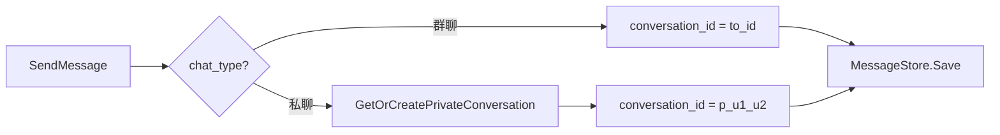
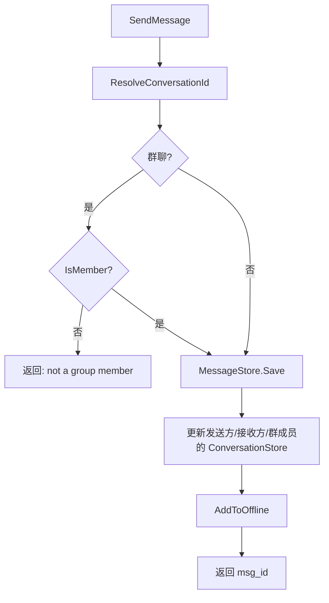

# 统一会话模型：私聊与群聊的消息存储与离线队列

> 本文是 SwiftChatSystem 后端系列博客的第九篇，介绍 ChatSvr 的职责划分、统一会话模型（conversation_id）、MessageStore / ConversationStore / GroupStore 设计、消息发送与历史拉取、撤回、@ 提醒、已读回执、离线消息队列，以及群组的创建、邀请、踢人、转让群主等能力。

---

## 一、ChatSvr 的职责边界

ChatSvr 在 SwiftChatSystem 中承担「消息」与「群组」两大类能力，同一个进程内同时运行 ChatService 与 GroupService：

| 能力域 | 说明 |
|--------|------|
| **消息** | 发送、撤回、历史拉取、离线队列、已读回执、会话同步、删除会话 |
| **群组** | 创建群、邀请/踢人、转让群主、设置管理员、退出群、解散群 |

消息与群组在数据上关联：群聊的 `conversation_id` 即为 `group_id`，发送群消息时需要 GroupStore 校验成员身份并确定离线推送对象。

---

## 二、统一会话模型与 conversation_id

### 2.1 两种会话类型

| 类型 | chat_type | conversation_id | 说明 |
|------|-----------|-----------------|------|
| 私聊 | 1 (PRIVATE) | `p_{user_id_1}_{user_id_2}` | 两人唯一会话，由 ConversationRegistry 生成 |
| 群聊 | 2 (GROUP) | `group_id` | 群 ID 即会话 ID |

私聊的 conversation_id 需要保证**两人之间唯一**：无论 A 发给 B 还是 B 发给 A，都使用同一会话。实现方式为将两个 user_id 排序后拼接，例如 `p_u1_u2`（u1 < u2）。

### 2.2 GetOrCreatePrivateConversation

```cpp
// RocksDBConversationRegistry
std::string GetOrCreatePrivateConversation(const std::string& user_id_1,
                                           const std::string& user_id_2) {
    std::string a = user_id_1, b = user_id_2;
    if (a > b) std::swap(a, b);
    std::string conversation_id = "p_" + a + "_" + b;

    std::string key = "conv_meta:" + conversation_id;
    std::string value;
    if (!impl_->db->Get(rocksdb::ReadOptions(), key, &value).ok()) {
        json j;
        j["type"] = "private";
        impl_->db->Put(wo, key, j.dump());  // 首次创建
    }
    return conversation_id;
}
```

**要点**：`conv_meta:{conversation_id}` 存会话元信息；首次访问时写入，实现 get-or-create 语义。

### 2.3 消息存储的 conversation_id 解析



发送消息时：私聊通过 `GetOrCreatePrivateConversation(from, to)` 得到 conversation_id；群聊直接使用 `to_id`（即 group_id）。

---

## 三、Store 与 RocksDB Key 设计

### 3.1 MessageStore

| Key 模式 | 示例 | Value | 说明 |
|----------|------|-------|------|
| `msg:{msg_id}` | `msg:m_xxx` | MessageData JSON | 消息正文 |
| `chat:{conversation_id}:{rev_ts}:{msg_id}` | `chat:p_u1_u2:999...:m_xxx` | "" | 会话时间线索引 |
| `offline:{user_id}:{rev_ts}:{msg_id}` | `offline:u_1:999...:m_xxx` | "" | 离线队列索引 |

**rev_ts 设计**：`rev_ts = MAX_TS - timestamp`，使键按时间**倒序**排列，RocksDB 顺序迭代即可实现「最新消息优先」的分页拉取。

### 3.2 ConversationStore

| Key 模式 | 示例 | Value | 说明 |
|----------|------|-------|------|
| `conv:{user_id}:{conversation_id}` | `conv:u_1:p_u1_u2` | ConversationData JSON | 用户侧会话摘要 |

ConversationData 包含：conversation_id、chat_type、peer_id、last_msg_id、unread_count、updated_at、is_pinned、is_muted。

### 3.3 ConversationRegistry（私聊元信息）

| Key 模式 | 示例 | Value | 说明 |
|----------|------|-------|------|
| `conv_meta:{conversation_id}` | `conv_meta:p_u1_u2` | `{"type":"private"}` | 私聊会话元信息 |

### 3.4 GroupStore

| Key 模式 | 示例 | Value | 说明 |
|----------|------|-------|------|
| `group:{group_id}` | `group:g_xxx` | GroupData JSON | 群元数据 |
| `group_member:{group_id}:{user_id}` | `group_member:g_xxx:u_1` | GroupMemberData JSON | 群成员 |
| `user_groups:{user_id}:{group_id}` | `user_groups:u_1:g_xxx` | "" | 用户加入的群索引 |

---

## 四、消息发送流程

### 4.1 流程图



### 4.2 核心逻辑

```cpp
SendResult ChatServiceCore::SendMessage(...) {
    std::string conversation_id;
    if (chat_type == ChatType::PRIVATE) {
        conversation_id = conv_registry_->GetOrCreatePrivateConversation(from_user_id, to_id);
    } else {
        conversation_id = to_id;
        if (group_store_ && !group_store_->IsMember(to_id, from_user_id)) {
            result.error = "not a group member";
            return result;
        }
    }

    MessageData msg;
    msg.msg_id = GenerateMsgId();
    msg.conversation_id = conversation_id;
    // ... 填充 content, mentions, media 等
    msg_store_->Save(msg);

    // 更新会话列表：发送方 + 接收方（私聊）或 除发送者外的所有成员（群聊）
    conv_store_->Upsert(from_user_id, conv_sender);
    if (chat_type == PRIVATE) {
        conv_store_->Upsert(to_id, conv_peer);
        conv_store_->UpdateUnread(to_id, conversation_id, 1);
    } else {
        for (const auto& m : members) {
            if (m.user_id != from_user_id) {
                conv_store_->Upsert(m.user_id, conv_m);
                conv_store_->UpdateUnread(m.user_id, conversation_id, 1);
            }
        }
    }

    // 离线队列：私聊给 to_id；群聊给除发送者外的所有成员
    if (chat_type == PRIVATE)
        msg_store_->AddToOffline(to_id, msg.msg_id);
    else {
        for (const auto& m : members)
            if (m.user_id != from_user_id)
                msg_store_->AddToOffline(m.user_id, msg.msg_id);
    }
}
```

---

## 五、撤回、@ 提醒、已读回执

### 5.1 撤回（2 分钟内）

```cpp
RecallResult RecallMessage(const std::string& msg_id, const std::string& user_id) {
    auto msg = msg_store_->GetById(msg_id);
    if (!msg || msg->from_user_id != user_id)
        return {false, "not allowed"};
    if (now - msg->timestamp > RECALL_TIMEOUT_SECONDS * 1000)  // 120 秒
        return {false, "recall timeout"};
    return msg_store_->MarkRecalled(msg_id, now) ? ... : ...;
}
```

撤回仅更新消息的 status=1、recall_at，**不删除**消息；历史拉取时客户端可根据 status 显示「消息已撤回」。

### 5.2 @ 提醒（mentions）

Proto 中 `ChatMessage` 包含 `repeated string mentions`，发送时由客户端传入被 @ 的 user_id 列表，服务端原样存储并下发。被 @ 用户可通过 mentions 做客户端侧高亮或推送；服务端不做额外逻辑。

### 5.3 已读回执（MarkRead）

```cpp
bool MarkRead(const std::string& user_id, const std::string& chat_id,
              ChatType chat_type, const std::string& last_msg_id) {
    std::string conversation_id = ResolveConversationId(user_id, chat_id, chat_type);
    conv_store_->ClearUnread(user_id, conversation_id);
    if (!last_msg_id.empty())
        msg_store_->ClearOffline(user_id, last_msg_id);
    return true;
}
```

MarkRead 做两件事：① 清除该会话未读数；② 清除离线队列中到 last_msg_id 为止的消息。Zone 在调用 ChatSvr.MarkRead 后，会通过 `RouteToUser` 推送 `chat.read_receipt` 给会话内其他成员（私聊推给对方，群聊推给全体），实现已读回执的实时同步。

---

## 六、离线消息：AddToOffline、PullOffline、ClearOffline

### 6.1 写入时机

发送消息时，对**需要接收但可能离线的用户**调用 `AddToOffline`：
- 私聊：接收方 to_id
- 群聊：除发送者外的所有成员

在线用户由 Zone 的 `RouteToUser` 实时推送；离线用户的消息进入 offline 队列，上线后通过 PullOffline 拉取。

### 6.2 拉取与游标

```cpp
OfflineResult PullOffline(const std::string& user_id, const std::string& cursor, int limit) {
    msg_store_->PullOffline(user_id, cursor, limit,
                            result.next_cursor, result.has_more);
    return result;
}
```

`cursor` 为上次返回的 rev_ts，用于分页；`next_cursor` 与 `has_more` 支持「拉取更多」。

### 6.3 清除

用户调用 MarkRead 并传入 last_msg_id 时，`ClearOffline(user_id, last_msg_id)` 会删除该用户离线队列中时间不晚于 last_msg_id 对应的消息的索引，避免重复推送。

---

## 七、群组：创建、邀请、踢人、转让群主

### 7.1 创建群（至少 3 人）

```cpp
CreateGroupResult CreateGroup(creator_id, group_name, avatar_url, member_ids) {
    std::set<std::string> unique;
    unique.insert(creator_id);
    for (const auto& id : member_ids) unique.insert(id);
    if (unique.size() < MIN_GROUP_MEMBERS)  // 3
        return {GROUP_MEMBERS_TOO_FEW};

    std::string group_id = GenerateShortId("g_", 12);
    store_->CreateGroup(data);
    store_->AddMember(group_id, owner);   // 创建者为群主
    for (const auto& uid : unique)
        if (uid != creator_id)
            store_->AddMember(group_id, m);
}
```

创建者 + 邀请成员去重后至少 3 人；不允许 1 人或 2 人建群（两人应使用私聊）。

### 7.2 邀请成员

仅对**当前不在群内**的用户生效；已是成员则跳过。

### 7.3 踢人（RemoveMember）

- 群主、管理员可踢人
- 不能踢群主
- 管理员不能踢管理员

### 7.4 转让群主（TransferOwner）

仅群主可操作；新群主必须已是成员。逻辑为：将原群主角色改为普通成员，将新群主角色改为群主，并更新 GroupData.owner_id。

### 7.5 退出群、解散群

| 操作 | 条件 | Store 行为 |
|------|------|------------|
| LeaveGroup | 非群主可退出 | RemoveMember |
| DismissGroup（group.dismiss） | 仅群主可解散 | DeleteGroup（物理删除群记录） |
| DeleteConversation（chat.delete_conversation，群聊） | 仅群主可删会话 | DissolveGroup（status=1，移除成员索引，保留消息） |

---

## 八、删除会话

### 8.1 私聊

私聊**不允许**删除会话，返回 `CONVERSATION_PRIVATE_CANNOT_DELETE`。私聊是两人共享的会话，单方删除会破坏一致性；若需「不显示」，可由客户端本地实现隐藏。

### 8.2 群聊

仅**群主**可删除群会话。删除时：
1. 调用 `GroupStore.DissolveGroup`：status=1，移除所有成员的 user_groups 与 group_member
2. 对每个原成员调用 `ConversationStore.Delete`，移除其会话入口
3. 消息**保留**在 MessageStore，群 ID 不再复用

---

## 九、客户端 cmd 与 Zone 分发

### 9.1 消息相关

| cmd | 说明 | 对应 RPC |
|-----|------|----------|
| chat.send_message | 发送消息 | SendMessage |
| chat.recall_message | 撤回消息 | RecallMessage |
| chat.pull_offline | 拉取离线消息 | PullOffline |
| chat.mark_read | 标记已读 | MarkRead |
| chat.get_history | 获取历史 | GetHistory |
| chat.sync_conversations | 同步会话列表 | SyncConversations |
| chat.delete_conversation | 删除会话（仅群聊，仅群主） | DeleteConversation |

### 9.2 群组相关

| cmd | 说明 | 对应 RPC |
|-----|------|----------|
| group.create | 创建群 | CreateGroup |
| group.dismiss | 解散群 | DismissGroup |
| group.invite_members | 邀请成员 | InviteMembers |
| group.remove_member | 移除成员 | RemoveMember |
| group.leave | 退出群 | LeaveGroup |
| group.get_info | 获取群信息 | GetGroupInfo |
| group.get_members | 获取群成员 | GetGroupMembers |
| group.get_user_groups | 获取用户群列表 | GetUserGroups |
| group.update | 更新群信息 | UpdateGroup |
| group.transfer_owner | 转让群主 | TransferOwner |
| group.set_member_role | 设置管理员 | SetMemberRole |

---

## 十、配置与小结

### 10.1 主要配置项

| 配置项 | 默认值 | 说明 |
|--------|--------|------|
| host / port | 0.0.0.0:9098 | 监听地址 |
| rocksdb_path | /data/chat | RocksDB 根路径（下含 group、message、conv、conv_meta） |
| recall_timeout_seconds | 120 | 撤回超时（秒） |
| jwt_secret | swift_online_secret_2026 | JWT 校验密钥 |

### 10.2 小结

ChatSvr 的核心设计可归纳为：

1. **统一会话**：私聊 `p_u1_u2`、群聊 `group_id`，消息统一按 conversation_id 存储
2. **时间线索引**：`chat:{conv_id}:{rev_ts}:{msg_id}`，rev_ts 倒序实现最新优先分页
3. **离线队列**：`offline:{user_id}:{rev_ts}:{msg_id}`，发送时 AddToOffline，上线 PullOffline，已读 ClearOffline
4. **会话列表**：`conv:{user_id}:{conversation_id}` 存 ConversationData，Upsert 更新、UpdateUnread 维护未读
5. **群组**：至少 3 人建群，邀请仅对非成员生效，踢人/转让有权限约束
6. **撤回**：2 分钟内仅发送者可撤回，MarkRecalled 更新 status，不删消息
7. **@ 提醒**：mentions 存储并下发，由客户端展示
8. **已读回执**：MarkRead 清未读 + 清离线，Zone 推送 read_receipt

下一篇文章将介绍 FileSvr 的富媒体支持、分块上传与 RocksDB 元数据存储，敬请期待。
