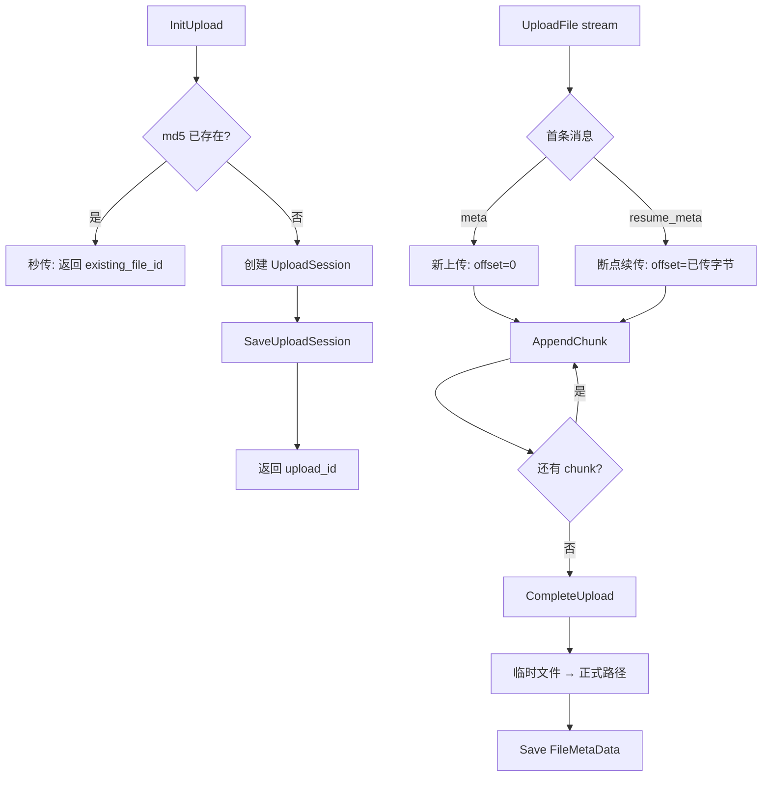

# 富媒体消息支持：分块上传与 RocksDB 元数据存储

> 本文是 SwiftChatSystem 后端系列博客的第十篇，介绍 FileSvr 的职责、gRPC 元数据管理与流式上传、UploadSession 与断点续传、FileStore 与 RocksDB 实现、md5 秒传、本地存储路径设计，以及后续 MinIO 扩展预留。

---

## 一、FileSvr 的职责边界

FileSvr 负责「文件」的元数据管理与存储，为 ChatSvr 的富媒体消息（图片、视频、语音、文件）提供上传与下载能力：

| 能力 | 说明 |
|------|------|
| 初始化上传 | InitUpload 返回 upload_id，用于分块/断点续传 |
| 流式上传 | UploadFile（gRPC 流），按 chunk 追加写入 |
| 查询进度 | GetUploadState 返回已传字节数，断线重连后据此续传 |
| 获取下载 URL | GetFileUrl 返回 HTTP 下载地址 |
| 文件信息 | GetFileInfo、DeleteFile |
| 上传凭证 | GetUploadToken 用于直传场景 |

与 ChatSvr 的联动：发送文件消息时，客户端先创建一条「上传中」消息，再 InitUpload（可带 msg_id），完成后调用 ChatSvr.CompleteFileMessage 更新消息状态；若 24h 内未完成，FileSvr 可通知 ChatSvr 将消息标为「发送失败」。

---

## 二、双协议：gRPC 控制 + HTTP 下载

### 2.1 端口分工

| 协议 | 端口 | 用途 |
|------|------|------|
| gRPC | 9100 | InitUpload、UploadFile、GetUploadState、GetFileUrl、GetFileInfo、DeleteFile、GetUploadToken |
| HTTP | 8080 | GET /files/{file_id} 下载文件，支持 Range 断点续传 |

元数据与控制走 gRPC，大文件下载走 HTTP，便于 CDN、反向代理与 Range 支持。

### 2.2 文件 URL 构建

```cpp
std::string BuildFileUrl(const std::string& file_id) {
    std::string host = config_.host;
    if (host == "0.0.0.0") host = "127.0.0.1";
    return "http://" + host + ":" + std::to_string(config_.http_port) +
           "/files/" + file_id;
}
```

客户端拿到 `file_url` 后，可直接用 HTTP GET 下载；服务端通过 HttpDownloadHandler 解析 Range 头，调用 `ReadFileRange` 实现断点续传。

---

## 三、UploadSession 与分块上传流程

### 3.1 流程图



### 3.2 InitUpload

```cpp
InitUploadResult InitUpload(user_id, file_name, content_type, file_size, md5, msg_id) {
    if (file_size > config_.max_file_size)  // 默认 1GB
        return {FILE_TOO_LARGE};

    // 秒传：md5 已存在则直接返回
    if (!md5.empty()) {
        auto existing = store_->GetByMd5(md5);
        if (existing) {
            out.success = true;
            out.existing_file_id = existing->file_id;
            out.upload_id = existing->file_id;  // 可直接作为「已完成」标识
            return out;
        }
    }

    std::string upload_id = GenerateFileId();
    std::string temp_path = config_.storage_path + "/.tmp/" + upload_id;
    int64_t expire_at = NowSeconds() + config_.upload_session_expire_seconds;  // 24h

    UploadSessionData session;
    session.upload_id = upload_id;
    session.user_id = user_id;
    session.file_name = file_name;
    session.content_type = content_type;
    session.file_size = file_size;
    session.md5 = md5;
    session.msg_id = msg_id;
    session.temp_path = temp_path;
    session.bytes_written = 0;
    session.expire_at = expire_at;

    store_->SaveUploadSession(session);
    return {upload_id, expire_at};
}
```

### 3.3 UploadFile 流式处理

Proto 定义 `UploadChunk` 的 oneof：
- `meta`：新上传，首条发此，带 upload_id
- `resume_meta`：断点续传，首条发此，带 upload_id + offset
- `chunk`：文件数据块

Handler 顺序读取流：首条解析 meta 或 resume_meta，后续逐条调用 `AppendChunk`，流结束后调用 `CompleteUpload`。

### 3.4 AppendChunk 与 CompleteUpload

```cpp
AppendChunkResult AppendChunk(upload_id, data, size) {
    auto s = store_->GetUploadSession(upload_id);
    if (!s) return {FILE_EXPIRED};
    if (s->bytes_written + size > s->file_size) return {INVALID_PARAM};

    std::ofstream f(s->temp_path, std::ios::binary | std::ios::app);
    f.write(data, size);
    store_->UpdateUploadSessionBytes(upload_id, s->bytes_written + size);
    return {new_offset};
}

CompleteUploadResult CompleteUpload(upload_id) {
    auto s = store_->GetUploadSession(upload_id);
    if (s->bytes_written != s->file_size) return {UPLOAD_INCOMPLETE};

    std::string file_id = GenerateFileId();
    std::string final_path = BuildStoragePath(file_id);  // storage/{id[0:2]}/{id}
    fs::rename(s->temp_path, final_path);

    FileMetaData meta{...};
    store_->Save(meta);
    store_->DeleteUploadSession(upload_id);
    return {file_id, BuildFileUrl(file_id)};
}
```

临时文件位于 `storage_path/.tmp/{upload_id}`，完成后重命名为正式路径并写入元数据。

---

## 四、FileStore 与 RocksDB Key 设计

### 4.1 Key 约定

| Key 模式 | 示例 | Value | 说明 |
|----------|------|-------|------|
| `file:{file_id}` | `file:abc123...` | FileMetaData JSON | 文件元信息 |
| `file_md5:{md5}` | `file_md5:d41d8cd98f...` | file_id | 秒传索引 |
| `upload:{upload_id}` | `upload:xyz789...` | UploadSessionData JSON | 上传会话 |

### 4.2 FileMetaData

```cpp
struct FileMetaData {
    std::string file_id;
    std::string file_name;
    std::string content_type;
    int64_t file_size = 0;
    std::string md5;
    std::string uploader_id;
    std::string storage_path;   // 本地路径
    int64_t uploaded_at = 0;
};
```

### 4.3 保存与删除时的 md5 索引

```cpp
bool RocksDBFileStore::Save(const FileMetaData& meta) {
    rocksdb::WriteBatch batch;
    batch.Put("file:" + meta.file_id, SerializeMeta(meta));
    if (!meta.md5.empty())
        batch.Put("file_md5:" + meta.md5, meta.file_id);
    return impl_->db->Write(wo, &batch).ok();
}

bool RocksDBFileStore::Delete(const std::string& file_id) {
    auto meta = GetById(file_id);
    batch.Delete("file:" + file_id);
    if (!meta->md5.empty())
        batch.Delete("file_md5:" + meta->md5);
    return impl_->db->Write(wo, &batch).ok();
}
```

---

## 五、md5 秒传

当客户端在 InitUpload 时传入 md5，且 `GetByMd5(md5)` 能查到已有文件，则直接返回 `existing_file_id`，**无需实际上传**。适用于重复发送同一文件的场景。

秒传仅在 InitUpload 阶段生效；若未传 md5 或库中无此 md5，则正常走分块上传流程。上传完成后，若 meta 中有 md5，会写入 `file_md5:{md5} -> file_id`，供后续秒传使用。

---

## 六、本地存储路径设计

### 6.1 目录结构

```
{storage_path}/
  .tmp/                    # 临时上传目录
    {upload_id}            # 上传中的文件
  {file_id[0:2]}/          # 按 file_id 前两位分目录
    {file_id}              # 正式文件
```

例如 `file_id = abc123...`，则路径为 `storage_path/ab/abc123...`，避免单目录下文件过多。

### 6.2 BuildStoragePath

```cpp
std::string BuildStoragePath(const std::string& file_id) {
    if (file_id.size() < 2) return config_.storage_path + "/" + file_id;
    return config_.storage_path + "/" + file_id.substr(0, 2) + "/" + file_id;
}
```

---

## 七、HTTP 下载与 Range 支持

### 7.1 HttpDownloadHandler

Handler 提供 `Serve(file_id, range_start, range_end, ...)`：
- 若 `range_start >= 0 && range_end >= range_start`，调用 `ReadFileRange` 返回指定区间
- 否则调用 `ReadFile` 返回完整文件

```cpp
bool ReadFileRange(const std::string& file_id, int64_t offset, int64_t length,
                   std::vector<char>& data, std::string& content_type,
                   std::string& file_name, int64_t& file_size) {
    auto meta = store_->GetById(file_id);
    if (!meta) return false;
    std::ifstream f(meta->storage_path, std::ios::binary);
    f.seekg(offset);
    f.read(data.data(), read_len);
    return true;
}
```

HTTP 层解析 `Range: bytes=0-1023`，即可实现断点续传下载。

### 7.2 当前部署说明

main.cpp 中仅启动 gRPC 服务；HTTP 下载需通过反向代理（如 Nginx 转发 `/files/*` 到 FileSvr 的 HTTP 模块）或另行挂载 HttpDownloadHandler 到 HTTP 服务器。设计上 FileUrl 已为 `http://host:8080/files/{file_id}`，便于接入。

---

## 八、与 ChatSvr 的联动

### 8.1 发文件消息流程

1. 客户端调用 ChatSvr.SendMessage，带 `file_size`、`media_type`，创建「上传中」消息（status=3）
2. 客户端调用 FileSvr.InitUpload，可选传 `msg_id` 关联
3. 客户端通过 UploadFile 流式上传
4. 上传完成后调用 ChatSvr.CompleteFileMessage，更新 msg 的 file_id、media_url，status 变为正常

### 8.2 超时放弃

InitUpload 的 `upload_session_expire_seconds` 默认 24 小时。若超时未完成，服务端可定期清理过期 UploadSession，删除临时文件；若 session 带有 `msg_id`，可调用 ChatSvr.MarkFileMessageFailed 将对应消息标为「发送失败」（status=4）。

---

## 九、配置与扩展

### 9.1 主要配置项

| 配置项 | 默认值 | 说明 |
|--------|--------|------|
| host | 0.0.0.0 | 监听地址 |
| grpc_port | 9100 | gRPC 端口 |
| http_port | 8080 | HTTP 下载端口 |
| storage_path | /data/files | 文件存储根目录 |
| rocksdb_path | /data/file-meta | 元数据 RocksDB 路径 |
| max_file_size | 1GB | 单文件大小上限 |
| upload_session_expire_seconds | 86400 | 上传会话过期时间（秒） |
| storage_type | local | local / minio / s3 |
| minio_endpoint, minio_bucket | - | MinIO 扩展用 |

### 9.2 MinIO 扩展预留

配置中已有 `storage_type`、`minio_endpoint`、`minio_access_key`、`minio_secret_key`、`minio_bucket`。后续可将 `BuildStoragePath` 改为生成 MinIO 的 object key，`ReadFile`/`ReadFileRange` 改为从 MinIO 拉取，元数据仍由 RocksDB 管理，实现对象存储接入。

---

## 十、小结

FileSvr 的核心设计可归纳为：

1. **双协议**：gRPC 负责上传控制与元数据，HTTP 负责下载（含 Range 断点续传）
2. **UploadSession**：InitUpload 创建会话，UploadFile 流式 AppendChunk，CompleteUpload 落盘并写元数据
3. **断点续传**：GetUploadState 返回 offset，resume_meta 指定续传起点，AppendChunk 顺序追加
4. **FileStore**：`file:{id}` 存元数据，`file_md5:{md5}` 存秒传索引，`upload:{id}` 存上传会话
5. **md5 秒传**：InitUpload 时若 md5 已存在则直接返回 file_id，跳过实际上传
6. **存储路径**：正式文件按 `{file_id[0:2]}/{file_id}` 分目录，临时文件在 `.tmp/{upload_id}`
7. **扩展**：storage_type、minio_* 配置为后续接入 MinIO/S3 预留

下一篇文章将介绍 RocksDB 存储层的整体设计、各 Store 的 Key 规范与 WriteBatch 原子写入，敬请期待。
