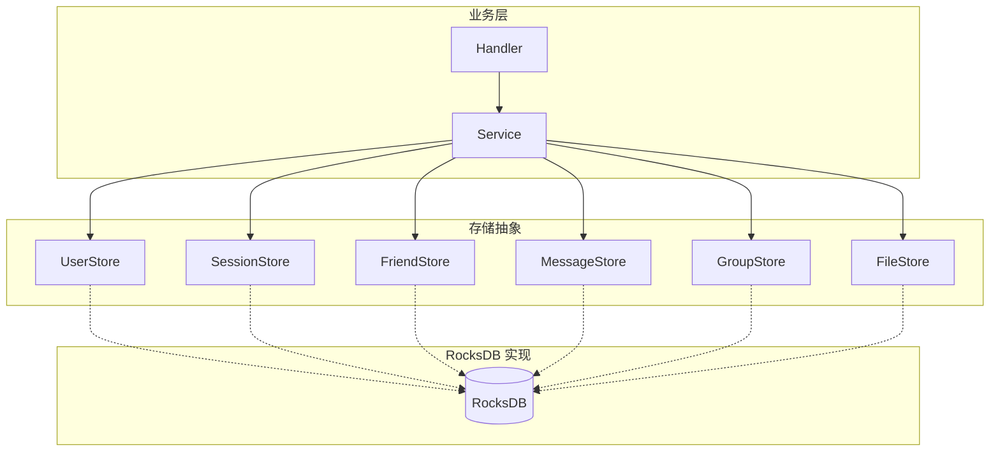

# C++ 微服务中的 RocksDB 存储层设计

> 本文是 SwiftChatSystem 后端系列博客的第十一篇，从整体视角梳理各服务的 Store 接口抽象与 RocksDB 实现、统一的 Key 设计规范、WriteBatch 原子写入、迭代器与前缀查询、JSON 序列化，以及可扩展性考量。

---

## 一、Store 接口抽象概览

SwiftChatSystem 中，业务逻辑通过 **Store 接口** 访问持久化数据，具体实现可替换（RocksDB、MySQL、Redis 等），业务层无需改动：



| 服务 | Store | 职责 |
|------|-------|------|
| AuthSvr | UserStore | 用户数据、username→user_id 索引 |
| OnlineSvr | SessionStore | 登录会话、token |
| FriendSvr | FriendStore | 好友关系、好友请求、分组、黑名单 |
| ChatSvr | MessageStore、ConversationStore、ConversationRegistry | 消息、会话列表、私聊会话元信息 |
| ChatSvr | GroupStore | 群组、群成员、用户群列表 |
| FileSvr | FileStore | 文件元信息、md5 索引、上传会话 |

---

## 二、Key 设计规范

### 2.1 通用格式

```
{类型}:{主键}:{可选子键}
```

类型前缀用于区分不同业务数据，便于迭代与排查；主键与子键组合形成唯一 Key。

### 2.2 全量 Key 汇总

| 前缀 | 格式示例 | Value | 用途 |
|------|----------|-------|------|
| `user:` | `user:u_123` | UserData JSON | 用户主数据 |
| `username:` | `username:alice` | user_id | 登录时按用户名查 |
| `session:` | `session:u_123` | SessionData JSON | 登录会话（OnlineSvr） |
| `friend:` | `friend:u_1:u_2` | FriendData JSON | 好友关系 |
| `friend_req:` | `friend_req:req_xxx` | FriendRequestData JSON | 好友请求 |
| `friend_req_to:` | `friend_req_to:u_2:req_xxx` | "" | 收到的请求索引 |
| `friend_req_from:` | `friend_req_from:u_1:req_xxx` | "" | 发出的请求索引 |
| `friend_group:` | `friend_group:u_1:default` | FriendGroupData JSON | 好友分组 |
| `block:` | `block:u_1:u_3` | "1" | 黑名单 |
| `msg:` | `msg:m_789` | MessageData JSON | 消息正文 |
| `chat:` | `chat:c_123:rev_ts:m_789` | "" | 会话时间线索引 |
| `conv:` | `conv:u_1:c_123` | ConversationData JSON | 用户会话列表 |
| `conv_meta:` | `conv_meta:p_u1_u2` | `{"type":"private"}` | 私聊会话元信息 |
| `offline:` | `offline:u_123:rev_ts:m_789` | "" | 离线消息索引 |
| `group:` | `group:g_xxx` | GroupData JSON | 群元数据 |
| `group_member:` | `group_member:g_xxx:u_1` | GroupMemberData JSON | 群成员 |
| `user_groups:` | `user_groups:u_1:g_xxx` | "" | 用户群列表索引 |
| `file:` | `file:abc123` | FileMetaData JSON | 文件元信息 |
| `file_md5:` | `file_md5:d41d8cd98f` | file_id | 秒传索引 |
| `upload:` | `upload:xyz789` | UploadSessionData JSON | 上传会话 |

---

## 三、WriteBatch 原子写入

当一次操作需要写入或删除多条记录时，使用 `rocksdb::WriteBatch` 保证**原子性**：要么全部成功，要么全部失败，避免中途崩溃导致数据不一致。

### 3.1 示例：UserStore.Create

注册需同时写入 `user:{id}` 与 `username:{name}`，缺一不可：

```cpp
bool RocksDBUserStore::Create(const UserData& user) {
    rocksdb::WriteBatch batch;
    batch.Put("user:" + user.user_id, SerializeUser(user));
    batch.Put("username:" + user.username, user.user_id);

    rocksdb::WriteOptions wo;
    wo.sync = true;
    return impl_->db->Write(wo, &batch).ok();
}
```

### 3.2 示例：FriendStore.AddFriend

好友关系为双向，需同时写入 A→B 与 B→A：

```cpp
bool RocksDBFriendStore::AddFriend(const FriendData& data) {
    rocksdb::WriteBatch batch;
    batch.Put(KeyFriend(data.user_id, data.friend_id), SerializeFriend(data));
    batch.Put(KeyFriend(data.friend_id, data.user_id), SerializeFriend(reverse));

    rocksdb::WriteOptions wo;
    wo.sync = true;
    return impl_->db->Write(wo, &batch).ok();
}
```

### 3.3 示例：MessageStore.Save

一条消息需写入消息本体与会话时间线索引：

```cpp
bool RocksDBMessageStore::Save(const MessageData& msg) {
    rocksdb::WriteBatch batch;
    batch.Put(KeyMsg(msg.msg_id), SerializeMessage(msg));
    batch.Put(KeyChat(conversation_id, msg.timestamp, msg.msg_id), "");

    rocksdb::WriteOptions wo;
    wo.sync = true;
    return impl_->db->Write(wo, &batch).ok();
}
```

### 3.4 示例：GroupStore.RemoveMember

踢人需同步更新 group_member、user_groups、group 的 member_count：

```cpp
rocksdb::WriteBatch batch;
batch.Delete(KeyGroupMember(group_id, user_id));
batch.Delete(KeyUserGroup(user_id, group_id));
batch.Put(KeyGroup(group_id), SerializeGroup(*g));  // 更新 member_count
return impl_->db->Write(wo, &batch).ok();
```

---

## 四、迭代器与前缀查询

RocksDB 的 key 按字典序排列，通过 `Seek(prefix)` + 迭代可高效实现「按前缀扫描」。

### 4.1 典型模式

```cpp
std::string prefix = "friend:u_123:";   // 例如好友列表
rocksdb::Slice prefix_slice(prefix);
std::unique_ptr<rocksdb::Iterator> it(impl_->db->NewIterator(rocksdb::ReadOptions()));

for (it->Seek(prefix); it->Valid(); it->Next()) {
    if (!it->key().starts_with(prefix_slice))
        break;
    // 处理 it->key() 和 it->value()
}
```

### 4.2 应用场景

| Store | 前缀 | 用途 |
|-------|------|------|
| FriendStore | `friend:{user_id}:` | 获取用户好友列表 |
| FriendStore | `friend_req_to:{user_id}:` | 获取收到的好友请求 |
| FriendStore | `friend_group:{user_id}:` | 获取好友分组 |
| FriendStore | `block:{user_id}:` | 获取黑名单 |
| MessageStore | `chat:{conversation_id}:` | 获取会话历史（配合 rev_ts 倒序） |
| MessageStore | `offline:{user_id}:` | 拉取离线消息 |
| ConversationStore | `conv:{user_id}:` | 获取用户会话列表 |
| GroupStore | `group_member:{group_id}:` | 获取群成员 |
| GroupStore | `user_groups:{user_id}:` | 获取用户加入的群 |

### 4.3 rev_ts 倒序设计

会话时间线与离线队列需「最新在前」分页。RocksDB 键按字典序升序，直接存 timestamp 则旧消息在前。采用 **rev_ts = MAX_TS - timestamp**（固定 13 位补齐）：

```
chat:p_u1_u2:9999987654321:m_001   → 最新消息
chat:p_u1_u2:9999987654320:m_002   → 次新
chat:p_u1_u2:9999987654319:m_003   → 更早
```

迭代时 Seek(prefix) 即从最新开始，顺序读取即可实现倒序分页。

---

## 五、JSON 序列化与反序列化

各 Store 使用 `nlohmann::json` 将结构体与 JSON 互转，Value 存 JSON 字符串。

### 5.1 序列化示例

```cpp
std::string SerializeUser(const UserData& user) {
    json j;
    j["user_id"] = user.user_id;
    j["username"] = user.username;
    j["password_hash"] = user.password_hash;
    j["nickname"] = user.nickname;
    // ...
    return j.dump();
}
```

### 5.2 反序列化示例

```cpp
UserData DeserializeUser(const std::string& data) {
    json j = json::parse(data);
    UserData user;
    user.user_id = j.value("user_id", "");
    user.username = j.value("username", "");
    user.password_hash = j.value("password_hash", "");
    // ...
    return user;
}
```

`j.value("key", default)` 可在字段缺失时使用默认值，提高兼容性。

### 5.3 特殊处理

- 数组：`j["mentions"]` 为 array 时需遍历 `j["mentions"]` 逐项 `get<std::string>()`
- 数字：`j.value("created_at", static_cast<int64_t>(0))` 避免类型问题
- 可选字段：`j.contains("md5")` 判断后再读取

---

## 六、RocksDB 配置

### 6.1 通用 Options

```cpp
rocksdb::Options options;
options.create_if_missing = true;
options.IncreaseParallelism();
options.OptimizeLevelStyleCompaction();

rocksdb::Status status = rocksdb::DB::Open(options, db_path, &db);
```

- `create_if_missing = true`：路径不存在时自动创建
- `IncreaseParallelism()`：利用多核加速
- `OptimizeLevelStyleCompaction()`：优化 compaction 性能

### 6.2 WriteOptions

```cpp
rocksdb::WriteOptions wo;
wo.sync = true;   // 落盘后才返回，保证持久化
impl_->db->Write(wo, &batch);
```

生产环境通常使用 `sync = true`，避免进程崩溃导致 WAL 未落盘而丢数据。

---

## 七、多 DB 与路径规划

各服务使用**独立的 RocksDB 实例**，路径分离：

| 服务 | 路径示例 | 说明 |
|------|----------|------|
| AuthSvr | `/data/auth` | 单库 |
| OnlineSvr | `/data/online` | 单库 |
| FriendSvr | `/data/friend` | 单库 |
| ChatSvr | `/data/chat/message`、`/data/chat/conv`、`/data/chat/conv_meta`、`/data/chat/group` | 多库 |
| FileSvr | `/data/file-meta` | 单库 |

ChatSvr 将 message、conv、conv_meta、group 分库，降低单库体积，便于备份与迁移。

---

## 八、扩展与替换

### 8.1 接口抽象的价值

业务层依赖 `UserStore`、`FriendStore` 等接口，而非 `RocksDBUserStore`。若需接入 MySQL：

```cpp
class MySQLUserStore : public UserStore {
    bool Create(const UserData& user) override { /* SQL INSERT */ }
    std::optional<UserData> GetById(const std::string& user_id) override { /* SELECT */ }
    // ...
};
```

只需在 main 中替换 `store = std::make_shared<MySQLUserStore>(...)`，Service 与 Handler 无需改动。

### 8.2 Key 命名的可移植性

当前 Key 设计为 RocksDB/Redis 等 KV 存储优化。若迁移到 MySQL，可将 `user:u_123` 映射为表 `user` 主键 `u_123`，`username:alice` 映射为唯一索引；语义保持一致，迁移成本可控。

---

## 九、小结

SwiftChatSystem 的 RocksDB 存储层设计可归纳为：

1. **Store 接口抽象**：Handler → Service → Store，实现可替换
2. **Key 规范**：`{类型}:{主键}:{子键}`，类型前缀统一、便于迭代
3. **WriteBatch**：多 Key 写入/删除用 WriteBatch 保证原子性
4. **迭代器与前缀**：Seek(prefix) + 迭代实现前缀查询；rev_ts 倒序支持「最新优先」分页
5. **JSON 序列化**：nlohmann::json 统一 Value 格式，便于调试与兼容
6. **配置与路径**：create_if_missing、sync、多 DB 路径规划
7. **可扩展性**：接口抽象支持替换为 MySQL、Redis 等存储

下一篇文章将介绍 ZoneSvr 中的 gRPC Client 封装与 RPC 调用模式，敬请期待。
