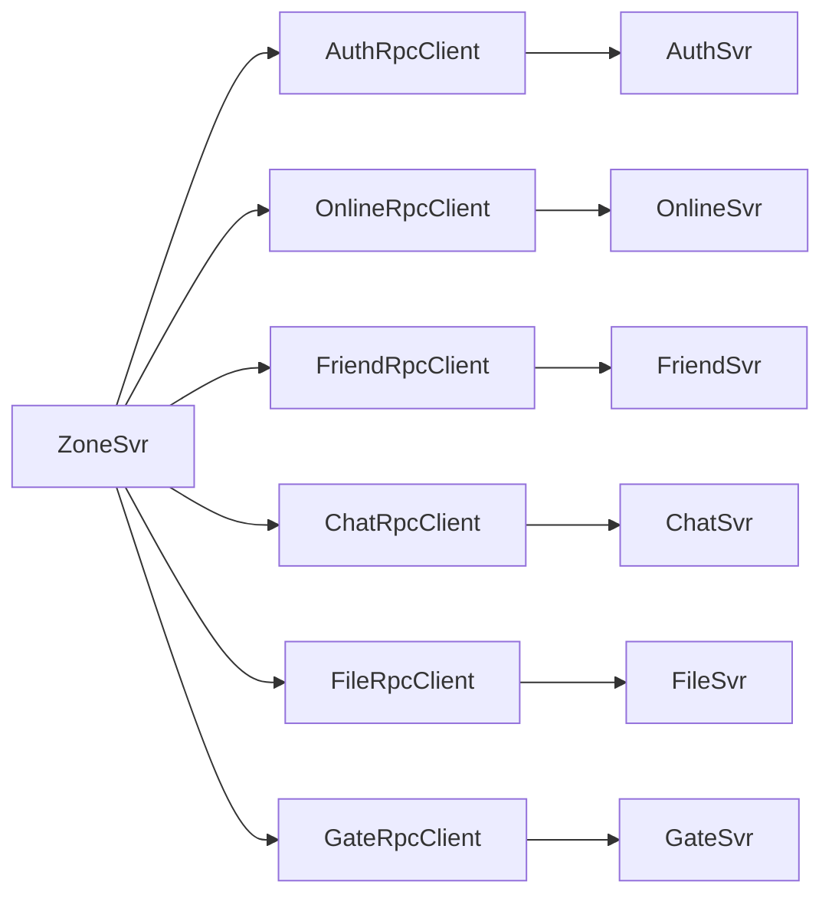

# ZoneSvr 中的 gRPC Client 封装与 RPC 调用模式

> 本文是 SwiftChatSystem 后端系列博客的第十二篇，介绍 ZoneSvr 如何通过 RpcClientBase 统一管理连接、超时与 Token 注入，各业务 RPC Client 的职责与调用方式，以及 Gate 多实例下的 Client 池与 K8s 负载均衡预留。

---

## 一、为什么需要 RPC Client 封装

ZoneSvr 作为 API Gateway，不实现业务逻辑，只做 **cmd 分发 + RPC 转发**。每次处理客户端请求（如 `friend.add`、`chat.send_message`）时，需要调用后端服务（FriendSvr、ChatSvr 等）。若在业务代码里直接创建 `grpc::Channel`、构造 `ClientContext`、设置超时和 metadata，会重复且易错。因此将通用能力下沉到 **RpcClientBase**，各业务的 **XxxRpcClient** 只关心请求/响应与 Stub 调用。



---

## 二、RpcClientBase：连接、超时与 Token 注入

### 2.1 接口

```cpp
class RpcClientBase {
public:
    /// 连接到服务；wait_ready=false 时仅创建 channel 不等待就绪（用于 standalone 测试）
    bool Connect(const std::string& address, bool wait_ready = true);

    /// 断开连接
    void Disconnect();

    /// 检查连接状态
    bool IsConnected() const;

    const std::string& GetAddress() const { return address_; }

protected:
    std::shared_ptr<grpc::Channel> GetChannel();  // 供子类创建 Stub

    /// 创建带超时的 Context；token 非空时注入 authorization: Bearer <token>
    std::unique_ptr<grpc::ClientContext> CreateContext(int timeout_ms = 5000,
                                                        const std::string& token = "");
private:
    std::string address_;
    std::shared_ptr<grpc::Channel> channel_;
};
```

### 2.2 Connect 实现

```cpp
bool RpcClientBase::Connect(const std::string& address, bool wait_ready) {
    address_ = address;

    grpc::ChannelArguments args;
    args.SetMaxReceiveMessageSize(64 * 1024 * 1024);  // 64MB
    args.SetMaxSendMessageSize(64 * 1024 * 1024);

    channel_ = grpc::CreateCustomChannel(
        address,
        grpc::InsecureChannelCredentials(),
        args
    );

    if (!wait_ready) return true;
    auto deadline = std::chrono::system_clock::now() + std::chrono::seconds(5);
    return channel_->WaitForConnected(deadline);
}
```

- **CreateCustomChannel**：可传入 `ChannelArguments`，此处用于放宽消息大小限制（大文件元数据、长消息列表等）。
- **wait_ready**：为 `true` 时等待 Channel 就绪再返回；为 `false` 时仅创建 Channel，不阻塞。Zone 配置 `standalone=true` 时传 `!config_->standalone`，即不等待后端就绪，便于单测或仅测 Gate 路由时启动。

### 2.3 CreateContext：超时与 JWT 注入

```cpp
std::unique_ptr<grpc::ClientContext> RpcClientBase::CreateContext(int timeout_ms,
                                                                   const std::string& token) {
    auto context = std::make_unique<grpc::ClientContext>();
    auto deadline = std::chrono::system_clock::now() +
                    std::chrono::milliseconds(timeout_ms);
    context->set_deadline(deadline);
    if (!token.empty())
        context->AddMetadata("authorization", "Bearer " + token);
    return context;
}
```

- **set_deadline**：每次 RPC 可单独设置超时（如 Auth 5s、Chat 发消息 10s）。
- **AddMetadata("authorization", "Bearer " + token)**：业务服务通过 `GetAuthenticatedUserId(context, jwt_secret)` 从 metadata 取 Token 并校验，**不信任请求体中的 user_id**，因此 Zone 必须在调用需要鉴权的接口时传入当前连接的 token。

---

## 三、各 RPC Client 与调用方

### 3.1 一览

| Client | 连接地址配置 | 是否需要 Token | 典型用途 |
|--------|--------------|----------------|----------|
| AuthRpcClient | auth_svr_addr | 否（VerifyCredentials/GetProfile 等按需） | 登录校验、资料 |
| OnlineRpcClient | online_svr_addr | 否 | Login、Logout、ValidateToken |
| FriendRpcClient | friend_svr_addr | 是 | 好友增删、分组、黑名单 |
| ChatRpcClient | chat_svr_addr | 是 | 发消息、历史、离线、已读 |
| GroupRpcClient | chat_svr_addr | 是 | 建群、邀请、踢人（与 Chat 同进程） |
| FileRpcClient | file_svr_addr | 是 | InitUpload、GetFileUrl 等 |
| GateRpcClient | 动态（gate_addr） | 否（内网） | 推送消息、断开连接 |

Auth、Online 的接口多为「登录前」或服务间内部调用，不依赖请求方 JWT；Friend、Chat、Group、File 的业务接口需要鉴权，调用时传入 token。

### 3.2 子类模式：InitStub + GetChannel

每个 RpcClient 在 `Connect` 后调用 `InitStub()`，用基类的 `GetChannel()` 创建对应服务的 Stub：

```cpp
// auth_rpc_client.cpp
void AuthRpcClient::InitStub() {
    stub_ = swift::auth::AuthService::NewStub(GetChannel());
}

bool AuthRpcClient::VerifyCredentials(...) {
    if (!stub_) return false;
    swift::auth::VerifyCredentialsRequest req;
    req.set_username(username);
    req.set_password(password);
    swift::auth::VerifyCredentialsResponse resp;
    auto ctx = CreateContext(5000);   // 无 token
    grpc::Status status = stub_->VerifyCredentials(ctx.get(), req, &resp);
    // ...
}
```

```cpp
// friend_rpc_client.cpp
bool FriendRpcClient::AddFriend(..., const std::string& token) {
    if (!stub_) return false;
    swift::relation::AddFriendRequest req;
    req.set_user_id(user_id);
    req.set_friend_id(friend_id);
    req.set_remark(remark);
    swift::common::CommonResponse resp;
    auto ctx = CreateContext(5000, token);   // 注入 token
    grpc::Status status = stub_->AddFriend(ctx.get(), req, &resp);
    // ...
}
```

---

## 四、Zone 如何传递 JWT

### 4.1 请求链路中的 token 来源

客户端通过 WebSocket 发起的业务请求（如 `friend.add`），会经过 Gate → Zone。Gate 在转发时会把**当前连接**上已绑定的 `user_id` 和 `token` 一并传给 Zone（来自 auth.login 时 ValidateToken 成功后写入 Connection）。Zone 的 `HandleClientRequest` 按 cmd 分发到对应 System 时，会把该 **token** 传入：

```cpp
// Zone 处理 friend.add 时
bool ok = fr->AddFriend(req.user_id(), req.friend_id(), req.remark(), token);
// FriendSystem::AddFriend 内部：
return rpc_client_->AddFriend(user_id, friend_id, remark, "", &err, token);
// FriendRpcClient::AddFriend 内部：
auto ctx = CreateContext(5000, token);
stub_->AddFriend(ctx.get(), req, &resp);
```

因此，**业务 RPC 的 metadata 里的 authorization 来自当前 WebSocket 连接登录时下发的 JWT**，后端据此鉴权。

### 4.2 不需要 token 的调用

- **AuthSvr.VerifyCredentials**：登录前，无 token。
- **OnlineSvr.Login / ValidateToken**：登录流程或连接绑定，由 Zone 按协议传入参数，不依赖客户端 token。
- **GateRpcClient.PushMessage / DisconnectUser**：Zone 调 Gate 为内网行为，当前实现未带业务 JWT；若 Gate 需要校验调用方，可走内网密钥（如 x-internal-secret）。

---

## 五、System 初始化与 Connect

各 System 在 Zone 启动时根据配置创建对应 RPC Client 并连接：

```cpp
// friend_system.cpp
bool FriendSystem::Init() {
    if (!config_) return true;
    rpc_client_ = std::make_unique<FriendRpcClient>();
    if (!rpc_client_->Connect(config_->friend_svr_addr, !config_->standalone))
        return false;
    rpc_client_->InitStub();
    return true;
}
```

配置项示例（zone.conf 或环境变量）：

| 配置项 | 默认值 | 说明 |
|--------|--------|------|
| auth_svr_addr | localhost:9094 | AuthSvr |
| online_svr_addr | localhost:9095 | OnlineSvr |
| friend_svr_addr | localhost:9096 | FriendSvr |
| chat_svr_addr | localhost:9098 | ChatSvr（含 GroupService） |
| file_svr_addr | localhost:9100 | FileSvr |
| gate_svr_addr | localhost:9091 | 默认 Gate（实际按 SessionStore 中 gate_addr 动态连接） |
| standalone | false | 为 true 时 Connect(addr, false)，不等待后端就绪 |

---

## 六、GateRpcClient 与多 Gate 实例

Zone 需要向**多个 Gate 实例**推送消息（不同用户连接在不同 Gate 上）。SessionStore 中每条会话记录包含 **gate_addr**（该用户所在 Gate 的 gRPC 地址）。推送时按地址取或创建 Client：

```cpp
std::shared_ptr<GateRpcClient> ZoneServiceImpl::GetOrCreateGateClient(const std::string& gate_addr) {
    if (gate_addr.empty()) return nullptr;
    std::lock_guard<std::mutex> lock(gate_clients_mutex_);
    auto it = gate_clients_.find(gate_addr);
    if (it != gate_clients_.end()) {
        auto& client = it->second;
        if (client->IsConnected()) return client;
        client->Disconnect();
    }
    auto client = std::make_shared<GateRpcClient>();
    if (!client->Connect(gate_addr)) return nullptr;
    client->InitStub();
    gate_clients_[gate_addr] = client;
    return client;
}

bool ZoneServiceImpl::PushToGate(const std::string& gate_addr, const std::string& user_id,
                                 const std::string& cmd, const std::string& payload) {
    auto client = GetOrCreateGateClient(gate_addr);
    if (!client) return false;
    return client->PushMessage(user_id, cmd, payload, nullptr);
}
```

即 **按 gate_addr 缓存的 Client 池**：同一 Gate 地址复用同一 Channel，避免为每次推送新建连接。

---

## 七、负载均衡与 K8s Headless Service

### 7.1 单地址与多副本

当前配置为**单地址**（如 `friend_svr_addr = localhost:9096`）。在 K8s 中若 FriendSvr 有多副本，通常有两种方式：

1. **Service 集群 IP**：`friend_svr_addr = friend-svc:9096`，由 K8s 默认负载均衡到任一 Pod，gRPC 可复用同一 Channel 的多路复用。
2. **Headless Service**：`friend_svr_addr = friend-svc` 且使用 Headless（clusterIP: None），DNS 解析会返回所有 Pod IP 的列表；若 gRPC 客户端使用该域名，不同连接可能解析到不同 Pod，实现 DNS 轮询。当前实现为**单地址单 Channel**，若需「每个 Pod 一个 Channel」的负载均衡，可在 Zone 侧维护多个地址或使用 gRPC 的负载均衡策略（如 round_robin）。

### 7.2 环境变量覆盖

生产环境常通过环境变量覆盖地址，例如：

```bash
ZONESVR_FRIEND_SVR_ADDR=friend-svc:9096
ZONESVR_CHAT_SVR_ADDR=chat-svc:9098
```

这样无需改配置文件即可适配 K8s 服务发现。

---

## 八、超时与错误处理

### 8.1 按接口设置超时

不同 RPC 耗时不同，CreateContext 的 **timeout_ms** 按需传入：

- 一般查询（GetProfile、GetFriends）：5000 ms
- 发消息、拉离线：10000 ms
- 文件上传初始化：5000 ms

```cpp
auto ctx = CreateContext(5000);    // Auth
auto ctx = CreateContext(10000);   // Chat.SendMessage
auto ctx = CreateContext(5000, token);  // Friend
```

### 8.2 统一错误处理

各 Client 内通常先检查 `status.ok()`，再检查响应体中的业务 code：

```cpp
grpc::Status status = stub_->AddFriend(ctx.get(), req, &resp);
if (!status.ok()) {
    if (out_error) *out_error = status.error_message();
    return false;
}
if (resp.code() != 0 && out_error)
    *out_error = resp.message().empty() ? "add friend failed" : resp.message();
return resp.code() == 0;
```

这样 Zone 层可把 gRPC 错误与业务错误统一映射为客户端可见的 code 与 message。

---

## 九、小结

1. **RpcClientBase**：统一 Connect、Disconnect、IsConnected、CreateContext；CreateContext 支持超时与 `authorization: Bearer <token>` 注入。
2. **各 RPC Client**：继承 Base，InitStub 用 GetChannel 创建 Stub，业务方法内组请求、CreateContext、调 Stub、处理响应与错误。
3. **JWT 传递**：需要鉴权的业务接口由 Zone 从当前请求会话中取 token，传入 RPC Client，Client 通过 CreateContext(timeout, token) 写入 metadata。
4. **Gate 多实例**：按 gate_addr 缓存 GateRpcClient，GetOrCreateGateClient 实现按需连接与复用。
5. **配置与扩展**：各后端地址通过配置文件 + 环境变量覆盖；K8s 下可配 Service 域名，Headless 可做 DNS 级负载均衡，更细粒度可依赖 gRPC LB 策略。

下一篇文章将介绍安全设计：防越权、Token 校验与内网认证，敬请期待。
