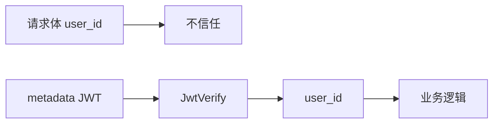

# 社交系统后端安全实践：防越权、Token 校验与内网认证

> 本文是 SwiftChatSystem 后端系列博客的第十三篇，从安全视角总结 API 鉴权（不信任 user_id、以 JWT 为准）、登录与业务接口的两种校验路径、ZoneSvr 内网密钥（InternalSecretProcessor、x-internal-secret），以及网络隔离与 K8s NetworkPolicy 的配合。

---

## 一、核心原则：不信任 user_id

客户端在请求体中可能携带 `user_id`（如 `friend.add` 的 payload 里有 user_id、friend_id）。若服务端**直接使用请求体中的 user_id** 执行业务，攻击者可以伪造：用 A 的 token 登录，却在 payload 里填 B 的 user_id，从而以 A 的身份操作 B 的数据（越权）。

因此约定：**凡涉及「当前用户」的接口，身份以 gRPC metadata 中的 JWT 解析结果为准，不信任请求体中的 user_id。**



实现方式：业务服务（AuthSvr、FriendSvr、ChatSvr、FileSvr 等）在 Handler 中调用 **GetAuthenticatedUserId(context, jwt_secret)**，用返回的 user_id 作为当前用户；请求体中的 user_id 仅作兼容或忽略。

---

## 二、GetAuthenticatedUserId：从 metadata 到 user_id

### 2.1 接口

```cpp
// backend/common grpc_auth.h
std::string GetAuthenticatedUserId(::grpc::ServerContext* context,
                                   const std::string& jwt_secret);
```

- 成功：返回 **user_id**（即 JWT payload 的 sub）
- 失败：返回 **空字符串**（未带 token / token 无效 / 过期）

### 2.2 Token 来源约定

客户端在 gRPC metadata 中携带 JWT，**任选其一**：

- `authorization: "Bearer <jwt>"`
- `x-token: "<jwt>"`

Zone 调用后端时通过 **RpcClientBase::CreateContext(timeout, token)** 注入 `authorization: Bearer <token>`，因此业务侧主要读取 `authorization`，兼容 `x-token`。

### 2.3 实现要点

```cpp
std::string GetAuthenticatedUserId(::grpc::ServerContext* context,
                                   const std::string& jwt_secret) {
    if (!context || jwt_secret.empty()) return "";
    std::string token = GetTokenFromContext(context);  // 从 metadata 取 token
    if (token.empty()) return "";
    JwtPayload payload = JwtVerify(token, jwt_secret);  // 仅本地验签，不查库
    if (!payload.valid) return "";
    return payload.user_id;
}
```

**不发起任何 RPC**，不查 OnlineSvr，不查库；仅用公共库 **JwtVerify** 做签名、exp、iss、sub 校验。

### 2.4 Handler 中的使用

```cpp
// 示例：FriendHandler::AddFriend
::grpc::Status FriendHandler::AddFriend(..., AddFriendRequest* request, ...) {
    std::string uid = RequireAuth(context, jwt_secret_, response);
    if (uid.empty()) return ::grpc::Status::OK;  // 已写 TOKEN_INVALID
    // 使用 uid，不使用 request->user_id()
    bool ok = service_->AddFriend(uid, request->friend_id(), request->remark());
    // ...
}
```

---

## 三、两种校验路径

系统里对 token 的校验发生在**两个不同位置**，行为不同。

### 3.1 场景 A：WebSocket 登录（ValidateToken，查 OnlineSvr）

| 步骤 | 角色 | 动作 |
|------|------|------|
| 1 | 客户端 | 连接 Gate WebSocket 后发 **auth.login**，payload 带 token、device_id、device_type |
| 2 | Gate | 转发给 Zone：HandleClientRequest(cmd=auth.validate_token, payload=token) |
| 3 | Zone | HandleAuth → AuthSystem → **OnlineRpcClient.ValidateToken(token)** |
| 4 | **OnlineSvr** | **ValidateToken**：① JwtVerify(token)；② **GetSession(user_id)**，校验 session 存在、session.token==token、session.expire_at>now |
| 5 | Gate | 有效则 BindUser、UserOnline；无效则返回 TOKEN_INVALID |

**作用**：确认「该 token 是否仍是当前有效会话」。登出后 Session 被删，ValidateToken 失败，无法用同一 token 再次绑定连接。

### 3.2 场景 B：业务接口（JwtVerify，不查库）

| 步骤 | 角色 | 动作 |
|------|------|------|
| 1 | 客户端 | 在已登录连接上发业务请求（如 friend.add）。Gate 从 Connection 取 **user_id + token**，随请求发给 Zone |
| 2 | Zone | 按 cmd 分发到 System；System 调后端时 **CreateContext(timeout, token)**，即 metadata 带 `authorization: Bearer <token>` |
| 3 | 后端 Handler | **GetAuthenticatedUserId(context, jwt_secret)** → 取 token → **JwtVerify** → 返回 user_id |
| 4 | 业务逻辑 | 仅使用该 user_id，不信任请求体中的 user_id |

**作用**：防止越权；不查 OnlineSvr，性能好。登出后、exp 前，该 token 在业务接口上仍会被接受（设计取舍见第七篇）。

### 3.3 对比小结

| 项目 | ValidateToken（场景 A） | GetAuthenticatedUserId → JwtVerify（场景 B） |
|------|-------------------------|---------------------------------------------|
| 调用方 | Gate 经 Zone 调 OnlineSvr | 各业务服务 Handler |
| 是否查库 | 是，SessionStore | 否 |
| 登出后 | 失败（会话已删） | exp 前仍通过 |
| 用途 | 连接身份绑定 | 业务接口鉴权、防伪造 user_id |

---

## 四、ZoneSvr 内网密钥：只接受可信调用方

ZoneSvr 的 gRPC 接口（UserOnline、HandleClientRequest、RouteToUser 等）应由 **GateSvr** 或其它内网组件调用，不应被外网或伪造客户端直接访问。为此采用**内网密钥**：调用方在每次请求的 metadata 中携带密钥，ZoneSvr 在入口处校验。

### 4.1 约定

- **Metadata 键名**：`x-internal-secret`
- **值**：与 ZoneSvr 配置的 `internal_secret` 一致（强随机字符串，仅环境变量注入）
- **配置**：ZoneSvr 的 `internal_secret`（如 `ZONESVR_INTERNAL_SECRET`）；GateSvr 的 `zonesvr_internal_secret` 与之一致
- **空密钥**：`internal_secret` 为空时**不校验**，仅建议开发环境使用；生产必须配置并配合网络隔离

### 4.2 InternalSecretProcessor

ZoneSvr 使用 gRPC 的 **AuthMetadataProcessor** 在业务执行前校验 metadata：

```cpp
// InternalSecretProcessor 继承 grpc::AuthMetadataProcessor
grpc::Status InternalSecretProcessor::Process(
    const InputMetadata& auth_metadata, ...) {
  if (expected_.empty())
    return grpc::Status::OK;   // 未配置则放行

  auto it = auth_metadata.find("x-internal-secret");
  if (it == auth_metadata.end())
    return grpc::Status(grpc::StatusCode::UNAUTHENTICATED,
                        "missing or invalid x-internal-secret");
  std::string value(it->second.data(), it->second.size());
  if (value != expected_)
    return grpc::Status(grpc::StatusCode::UNAUTHENTICATED,
                        "missing or invalid x-internal-secret");
  return grpc::Status::OK;
}
```

### 4.3 ZoneSvr 注册方式

```cpp
// zonesvr cmd/main.cpp
auto creds = grpc::InsecureServerCredentials();
if (!config.internal_secret.empty()) {
    creds->SetAuthMetadataProcessor(
        std::make_shared<swift::zone::InternalSecretProcessor>(config.internal_secret));
}
grpc::ServerBuilder builder;
builder.AddListeningPort(addr, creds);
builder.RegisterService(handler.get());
```

所有到达 ZoneSvr 的 gRPC 请求会先经过 Process，未通过则返回 UNAUTHENTICATED，不会进入业务 Handler。

### 4.4 GateSvr 调用时注入

GateSvr 的 ZoneRpcClient 在每次调用 Zone 时，在 ClientContext 上添加 metadata：

```cpp
static void AddInternalSecret(grpc::ClientContext* ctx, const std::string& secret) {
    if (!secret.empty())
        ctx->AddMetadata("x-internal-secret", secret);
}

// 例如 UserOnline
grpc::ClientContext ctx;
ctx.set_deadline(...);
AddInternalSecret(&ctx, zonesvr_internal_secret_);
stub_->UserOnline(&ctx, req, &resp);
```

这样只有持有同一密钥的 Gate（或其它内网服务）才能成功调用 Zone。

---

## 五、网络隔离与 K8s NetworkPolicy

内网密钥是**应用层**校验；**网络层**应配合隔离，减少暴露面。

### 5.1 原则

- ZoneSvr 仅监听内网地址（如 `0.0.0.0`），**不对外网暴露**；或通过 K8s Service 仅允许集群内访问。
- 仅允许 **GateSvr**、必要时其它可信服务（如运维脚本）访问 ZoneSvr 的 gRPC 端口。

### 5.2 K8s NetworkPolicy 示例思路

通过 NetworkPolicy 限制「谁可以访问 ZoneSvr」：

- 入站：仅允许来自 GateSvr 对应 Pod/Service 的流量访问 ZoneSvr 的端口（如 9092）。
- 命名空间：可将 ZoneSvr、GateSvr、业务后端放在同一命名空间，或按需限制跨命名空间访问。

示例（仅作思路，具体需按集群调整）：

```yaml
apiVersion: networking.k8s.io/v1
kind: NetworkPolicy
metadata:
  name: zonesvr-from-gatesvr-only
spec:
  podSelector:
    matchLabels:
      app: zonesvr
  policyTypes:
  - Ingress
  ingress:
  - from:
    - podSelector:
        matchLabels:
          app: gatesvr
    ports:
    - protocol: TCP
      port: 9092
```

实际部署时需与 Service/标签一致；若未使用 NetworkPolicy，至少通过 K8s Service 不对外暴露、仅集群内访问，也能降低风险。

### 5.3 小结

- **应用层**：InternalSecretProcessor 校验 `x-internal-secret`，拒绝未携带或错误的调用方。
- **网络层**：ZoneSvr 不对外网暴露 + NetworkPolicy 或 Service 白名单，仅允许 Gate 等访问。
- **敏感配置**：internal_secret 仅环境变量注入，不写入配置文件仓库。

---

## 六、小结

1. **防越权**：业务接口以 **GetAuthenticatedUserId** 得到的 user_id 为准，不信任请求体中的 user_id。
2. **两种校验**：WebSocket 登录用 **ValidateToken**（查 OnlineSvr Session）；业务接口用 **JwtVerify**（仅本地验签）。
3. **内网密钥**：ZoneSvr 通过 **InternalSecretProcessor** 校验 `x-internal-secret`；GateSvr 调用时 **AddMetadata("x-internal-secret", secret)**。
4. **网络隔离**：ZoneSvr 不对外暴露，K8s 下可配合 NetworkPolicy 仅允许 Gate 等访问，与内网密钥形成双重保障。

下一篇文章将介绍部署与运维：Docker Compose 与 Minikube，敬请期待。
