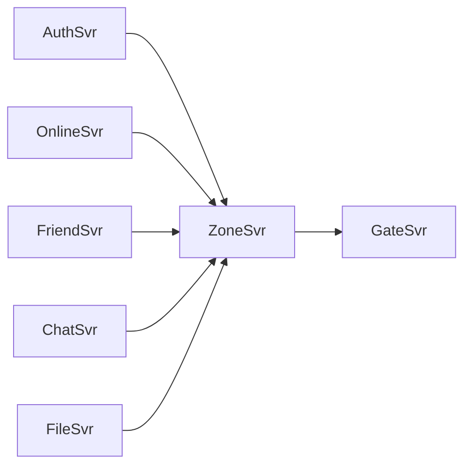

# SwiftChatSystem 部署实践：Docker Compose 与 Minikube

> 本文是 SwiftChatSystem 后端系列博客的第十四篇（末篇），介绍本地部署的配置与启动顺序、端口规划、Docker Compose 构建与运行、Minikube 下的 K8s 部署（ConfigMap、PV/PVC、Deployment、Service）、环境变量约定，以及未来可扩展方向（MySQL、Redis、MinIO、HPA、Prometheus）。

---

## 一、端口规划与依赖关系

### 1.1 服务端口一览

| 服务 | gRPC 端口 | 其他端口 | 说明 |
|------|-----------|----------|------|
| GateSvr | 9091 | WebSocket 9090 | 客户端连 9090，Zone 调 Gate 用 9091 |
| ZoneSvr | 9092 | - | 仅 gRPC，供 Gate 调用 |
| AuthSvr | 9094 | - | |
| OnlineSvr | 9095 | - | |
| FriendSvr | 9096 | - | |
| ChatSvr | 9098 | - | 含 GroupService |
| FileSvr | 9100 | HTTP 8080 | 文件下载 |

### 1.2 启动顺序建议

ZoneSvr 依赖各后端地址，GateSvr 依赖 ZoneSvr；业务后端（Auth、Online、Friend、Chat、File）之间无直接依赖，可先于 Zone 启动。



推荐顺序：**AuthSvr、OnlineSvr、FriendSvr、ChatSvr、FileSvr → ZoneSvr → GateSvr**。Docker Compose 中通过 `depends_on` 表达 Zone 依赖五类后端、Gate 依赖 Zone。

---

## 二、本地直接运行（无容器）

### 2.1 构建

```bash
./scripts/build-server.sh
# 或 make build
```

可执行文件位于 `build/backend/`：authsvr、onlinesvr、friendsvr、chatsvr、filesvr、zonesvr、gatesvr。

### 2.2 配置与环境变量

各服务从 **配置文件**（如 `authsvr.conf`）读取默认值，同名项可由 **环境变量** 覆盖，前缀与文档约定一致（如 `AUTHSVR_PORT`、`ZONESVR_AUTH_SVR_ADDR`）。

启动前需保证：
- ZoneSvr 的 `auth_svr_addr`、`online_svr_addr`、`friend_svr_addr`、`chat_svr_addr`、`file_svr_addr`、`gate_svr_addr` 指向实际监听地址
- GateSvr 的 `zone_svr_addr` 指向 ZoneSvr
- 各服务 RocksDB 路径可写（如 `./data/auth`、`./data/online` 等）

### 2.3 启动顺序示例

```bash
# 终端 1～5：业务后端（顺序无关）
./build/backend/authsvr authsvr.conf
./build/backend/onlinesvr onlinesvr.conf
./build/backend/friendsvr friendsvr.conf
./build/backend/chatsvr chatsvr.conf
./build/backend/filesvr filesvr.conf

# 终端 6：Zone（依赖上述地址在 conf 中配置正确）
./build/backend/zonesvr zonesvr.conf

# 终端 7：Gate（依赖 Zone）
./build/backend/gatesvr gatesvr.conf
```

客户端连接 `ws://localhost:9090/ws` 即可。

---

## 三、Docker Compose 部署

### 3.1 目录与用法

- 编排文件：`deploy/docker-compose.yml`
- 在**仓库根目录**执行：
  - 构建并启动：`docker compose -f deploy/docker-compose.yml up -d`
  - 仅构建镜像：需先执行 `deploy/docker/build-all.sh`（或项目内等效脚本）

### 3.2 服务与镜像

每个服务使用独立镜像，通过 build args 指定 `BUILD_TARGET`：

```yaml
services:
  authsvr:
    image: swift/authsvr:latest
    build:
      context: .
      dockerfile: deploy/docker/Dockerfile
      args:
        BUILD_TARGET: authsvr
```

其他服务同理：onlinesvr、friendsvr、chatsvr、filesvr、zonesvr、gatesvr。

### 3.3 端口与数据卷

- **端口映射**：与「端口规划」一致，如 9094、9095、9096、9098、9100、8080、9092、9090、9091 映射到宿主机
- **数据卷**：统一使用命名卷 `swift-data`，挂载到各容器的 `/data`，供 RocksDB、文件存储、日志使用

```yaml
volumes:
  - swift-data:/data
volumes:
  swift-data:
```

### 3.4 环境变量（Compose 内）

ZoneSvr 通过环境变量指定后端地址（Compose 中服务名即主机名）：

```yaml
environment:
  - ZONESVR_AUTH_SVR_ADDR=authsvr:9094
  - ZONESVR_ONLINE_SVR_ADDR=onlinesvr:9095
  - ZONESVR_FRIEND_SVR_ADDR=friendsvr:9096
  - ZONESVR_CHAT_SVR_ADDR=chatsvr:9098
  - ZONESVR_FILE_SVR_ADDR=filesvr:9100
  - ZONESVR_GATE_SVR_ADDR=gatesvr:9091
  - ZONESVR_SESSION_STORE_TYPE=memory
```

GateSvr 只需 Zone 地址：

```yaml
- GATESVR_ZONE_SVR_ADDR=zonesvr:9092
```

各业务服务的 `*_HOST`、`*_PORT`、`*_ROCKSDB_PATH`、`*_LOG_DIR` 等均在 Compose 中显式设置，便于统一修改。

### 3.5 依赖与启动顺序

- zonesvr：`depends_on: [authsvr, onlinesvr, friendsvr, chatsvr, filesvr]`
- gatesvr：`depends_on: [zonesvr]`

Compose 会按依赖顺序启动；`depends_on` 仅保证启动顺序，不保证后端已就绪，若 Zone 连接失败可适当延迟再试或使用健康检查。

---

## 四、Minikube（Kubernetes）部署

### 4.1 前置条件

- 已安装 **kubectl**、**Minikube**
- 建议集群资源：至少 2 核、4GB 内存，以便跑齐 7 个服务

```bash
minikube start --cpus=2 --memory=4096 --driver=docker
```

### 4.2 存储：hostPath 与 PVC

当前配置使用 **hostPath** 持久化 RocksDB 与文件存储。需在 Minikube 节点（即 Minikube 虚拟机）上创建目录：

```bash
minikube ssh
sudo mkdir -p /data/swift-chat /data/swift-files
sudo chmod 777 /data/swift-chat /data/swift-files
exit
```

`deploy/k8s/persistent-volume.yaml` 定义：
- **PersistentVolume**：`swift-data-pv`（path: `/data/swift-chat`）、`swift-files-pv`（path: `/data/swift-files`）
- **PersistentVolumeClaim**：`swift-data-pvc`、`swift-files-pvc`，供需要持久化数据的 Deployment 挂载

需要 `/data` 的 Deployment（如 authsvr、onlinesvr、friendsvr、chatsvr、filesvr）使用 `swift-data-pvc`；FileSvr 若单独挂载文件目录可使用 `swift-files-pvc`（按实际 YAML 为准）。

### 4.3 ConfigMap 与统一配置

`deploy/k8s/configmap.yaml` 中集中配置各服务环境变量，与 Docker Compose 中的约定一致：
- ZoneSvr：各 `*_SVR_ADDR` 使用 K8s 服务名（如 `authsvr:9094`）
- GateSvr：`GATESVR_ZONE_SVR_ADDR=zonesvr:9092`
- 各服务 LOG 目录、RocksDB 路径、端口等

Deployment 通过 `envFrom.configMapRef` 引用该 ConfigMap，无需在 Deployment 中重复写环境变量。

### 4.4 Deployment 与 Service

- 每个服务一个 **Deployment**（replicas 多为 1；Gate 可改为 2+ 做多副本）
- 每个服务一个 **Service**，端口与「端口规划」一致
- **GateSvr 的 Service** 使用 **NodePort**（如 30090），便于宿主机访问 WebSocket；其他服务为 ClusterIP，仅集群内访问

示例（gatesvr-deployment.yaml）：
- 暴露 9090（WebSocket）、9091（gRPC）
- Service 类型 NodePort，nodePort: 30090 → 9090

访问方式：
- `minikube service -n <namespace> gatesvr --url` 获取 Gate 的 URL，客户端使用 `ws://<host>:30090`
- 或 `minikube tunnel` 后通过 LoadBalancer/NodePort 从本机访问

### 4.5 镜像与命名空间

- 镜像：`swift/authsvr:latest` 等，需在 Minikube 内可用（本机构建后 `minikube image load swift/authsvr:latest`，或 `eval $(minikube docker-env)` 后构建）
- 当前 Kustomization 使用的命名空间为 **master**（见 `deploy/k8s/namespace.yaml` 与 `kustomization.yaml`），部署与查看时请使用实际应用的 namespace：

```bash
kubectl apply -k deploy/k8s
kubectl -n master get pods
kubectl -n master get svc
```

若文档中示例使用 `swift-chat`，请以 `kubectl apply -k` 实际创建的 namespace 为准。

### 4.6 简要流程汇总

```bash
# 1. 启动 Minikube
minikube start --cpus=2 --memory=4096 --driver=docker

# 2. 创建 hostPath 目录
minikube ssh -- "sudo mkdir -p /data/swift-chat /data/swift-files && sudo chmod 777 /data/swift-chat /data/swift-files"

# 3. 构建并导入镜像（项目根目录）
./deploy/docker/build-all.sh
for s in authsvr onlinesvr friendsvr chatsvr filesvr zonesvr gatesvr; do
  minikube image load swift/$s:latest
done

# 4. 部署
kubectl apply -k deploy/k8s

# 5. 查看 Pod / Service，获取 Gate 访问地址
kubectl -n master get pods
minikube service -n master gatesvr --url
```

---

## 五、配置与环境变量约定

### 5.1 通用

- **LOG_DIR**、**LOG_LEVEL**：日志目录与级别
- 各服务 **HOST**、**PORT**（或 **WEBSOCKET_PORT** / **GRPC_PORT**）：监听地址

### 5.2 ZoneSvr

- **ZONESVR_AUTH_SVR_ADDR**、**ONLINE_SVR_ADDR**、**FRIEND_SVR_ADDR**、**CHAT_SVR_ADDR**、**FILE_SVR_ADDR**、**GATE_SVR_ADDR**：后端与 Gate 的地址（host:port）
- **ZONESVR_SESSION_STORE_TYPE**：memory / redis
- **ZONESVR_REDIS_URL**：Redis 连接串（session_store_type=redis 时）
- **ZONESVR_INTERNAL_SECRET**：内网密钥（生产建议设置，Gate 侧 GATESVR_ZONESVR_INTERNAL_SECRET 需一致）

### 5.3 GateSvr

- **GATESVR_ZONE_SVR_ADDR**：ZoneSvr 地址
- **GATESVR_ZONESVR_INTERNAL_SECRET**：与 Zone 内网密钥一致

### 5.4 各业务服务

- **AUTHSVR_ROCKSDB_PATH**、**ONLINESVR_ROCKSDB_PATH** 等：RocksDB 或数据目录
- **FILESVR_STORAGE_PATH**、**FILESVR_HTTP_PORT**：文件存储路径与 HTTP 下载端口

敏感项（如 **ZONESVR_INTERNAL_SECRET**）建议仅通过环境变量注入，不写入配置文件仓库。

---

## 六、未来扩展方向

| 方向 | 说明 |
|------|------|
| **MySQL** | 将 AuthSvr、FriendSvr、ChatSvr 等持久化从 RocksDB 迁至 MySQL，便于事务与复杂查询 |
| **Redis** | ZoneSvr Session 已支持 redis；可将会话、在线状态、消息队列等迁至 Redis，便于多副本与集群 |
| **MinIO** | FileSvr 配置中已预留 storage_type、minio_*，可接入对象存储，替代本地磁盘 |
| **HPA** | 为 GateSvr、ZoneSvr、ChatSvr 等配置 HorizontalPodAutoscaler，按 CPU/内存或 QPS 自动扩缩容 |
| **Prometheus** | 暴露 metrics 端点，配置 ServiceMonitor 或 Prometheus 抓取，配合 Grafana 做监控与告警 |

上述扩展不影响现有「单机 RocksDB + 内存 Session」的部署方式，可按需逐步引入。

---

## 七、小结

1. **端口规划**：Gate 9090/9091，Zone 9092，Auth 9094，Online 9095，Friend 9096，Chat 9098，File 9100/8080；启动顺序建议业务后端 → Zone → Gate。
2. **Docker Compose**：单机一键部署，build 指定 BUILD_TARGET，volumes 统一 `/data`，环境变量配置各服务地址与存储路径，depends_on 控制启动顺序。
3. **Minikube**：hostPath PV/PVC 提供持久化，ConfigMap 统一环境变量，Deployment + Service 暴露服务，Gate 使用 NodePort 便于外网访问 WebSocket。
4. **配置约定**：各服务前缀 + 环境变量覆盖；内网密钥等敏感项仅环境变量注入。
5. **扩展**：MySQL、Redis、MinIO、HPA、Prometheus 等可按需接入，与当前架构兼容。

本系列共十四篇，从架构概览到协议、配置、网关、路由、认证、业务服务、存储、RPC、安全与部署已全部覆盖；若需深入某一块，可结合对应单篇与源码继续扩展。
